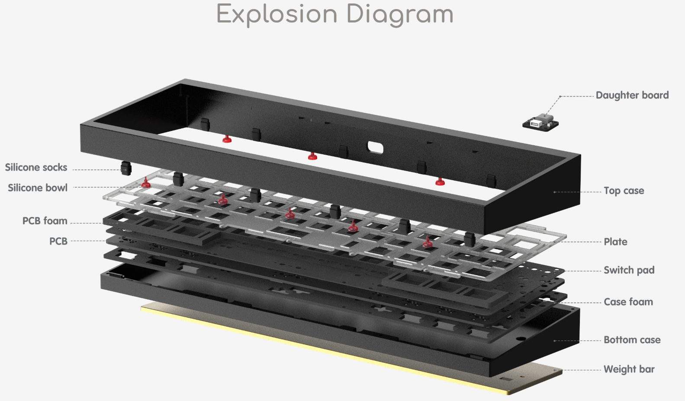
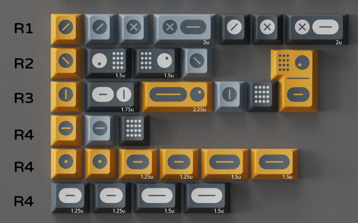
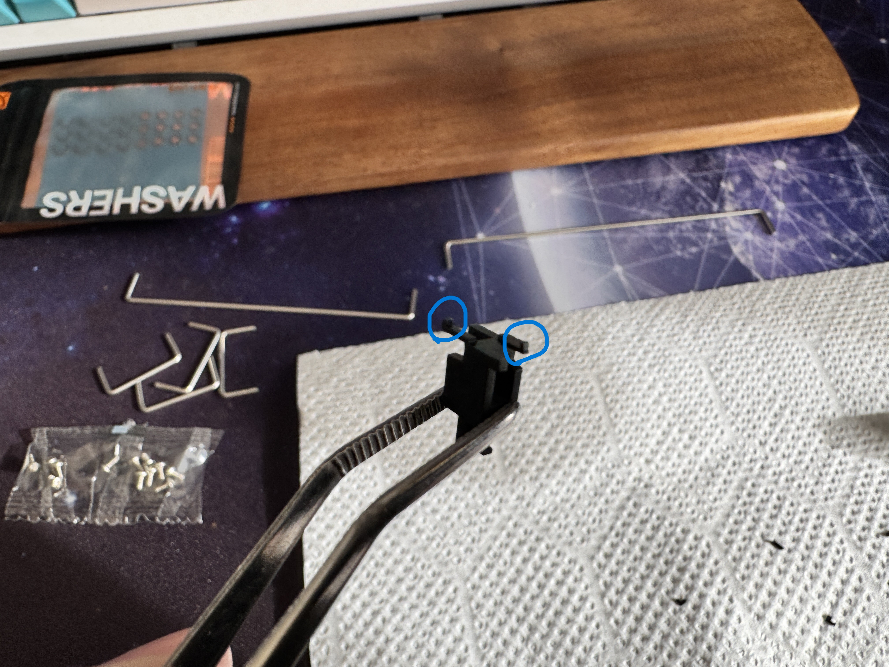
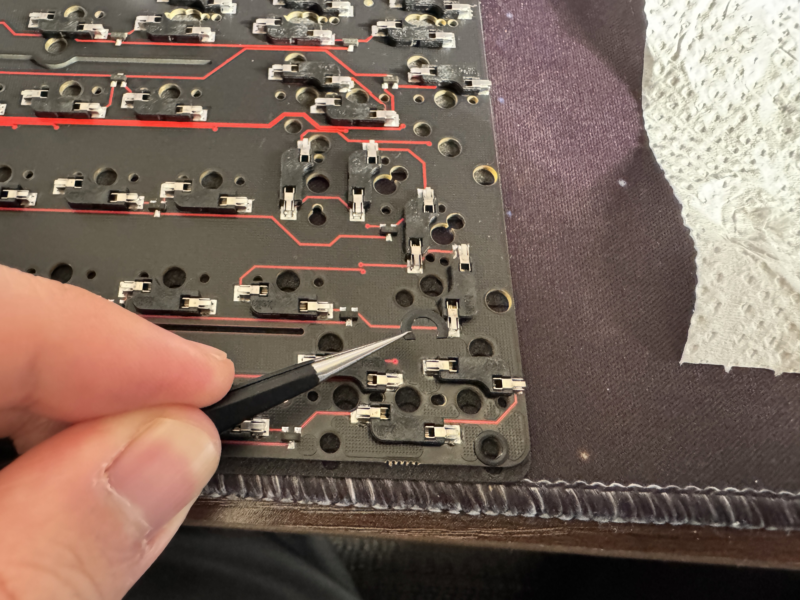
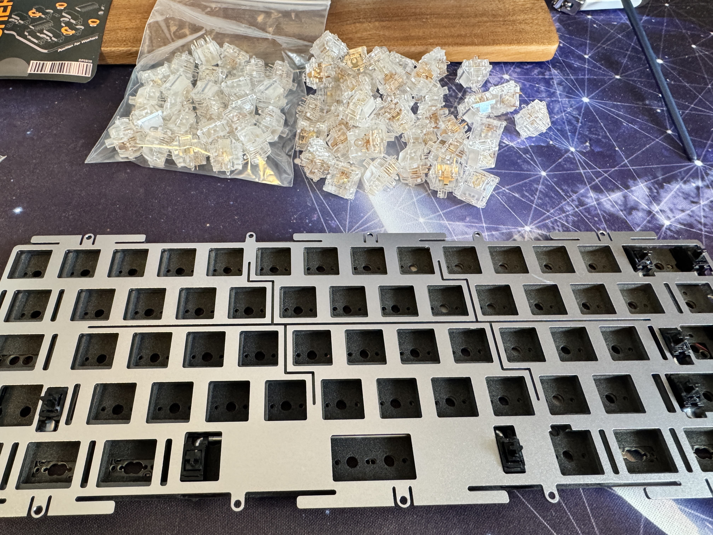
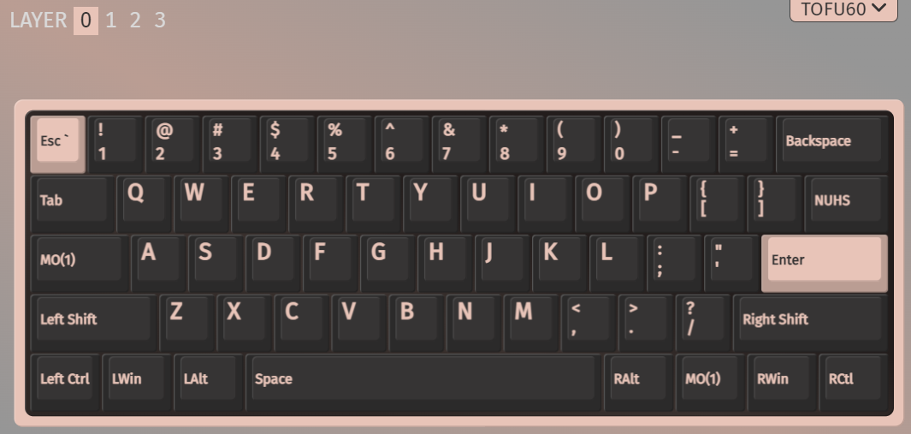
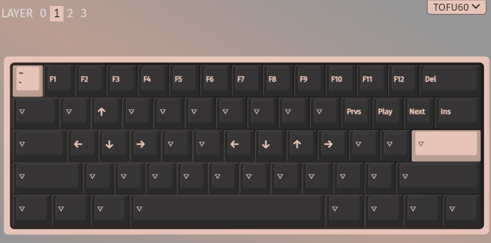

+++
author = "twoooooda"
title = "2代目自作キーボード奮闘記"
date = "2024-12-23"
description = "人生2回目の自作キーボード！"
tags = [
    "日記",
    "ガジェット",
    "散財", 
    "MyNewGear"
]
categories = [
    "ガジェット"
]

series = ["Themes Guide"]
aliases = ["migrate-from-jekyl"]
image = "IMG_7608.JPG"
slug="2nd-DIY-Keyboard"
+++

ちょうど3年前、人生初の自作キーボードをしました（[その時の記事](https://twoooooda.net/post/keybord-built-by-myself/)）。そのキーボードもそろそろ汚れてきましたし、ハイエンドな自作キーボードをしてみたいという気持ちが高まっていたので、初ボーナスが出たこのタイミングで2代目を作ってみることにしました。

## 構成
### パーツ選定
　当然ですが、こういった自作ものはパーツの選定がある意味最重要です。一般的に自作キーボードをしようとすると以下のようなものを揃える必要があります。

- 基盤などがセットになった**自作キット**
    - 場合によってはケース等バラバラで買うこともありますが、多くは基盤、ケース、プレート、間に挟む緩衝材などが一緒になったキットを買うことが多いです。
- **キースイッチ**
- **キーキャップ**

いろいろ考え抜いて、時には個人輸入もしながらパーツを買い集めました。

### 自作キット
　今回私は例にもれずキットを買って作ることにしました。購入したものはKBDfansという中国の会社が出している[Tofu60 2.0](https://kbdfans.com/collections/tofu60/products/tofu60-2-0)というキットです。このキットは自作キーボード界隈では多い**60%** といわれるレイアウトのキーボードを作れるキットです。ケースや基盤（PCB）、スタビライザー、緩衝材などキースイッチとキーキャップ以外のほぼすべてが同梱されているキットで、ガスケットマウントも2種類から選べるなどけっこう豪華なキットです。

　初代自作キーボードは98キーのキーボードを作ったのですが、テンキーはそこまで使わないし、机を広く使いたかったのでコンパクトなキーボードを探していました。海外からの個人輸入も視野に入れて探している時に、見た目もシンプルで、組み立てもそこまで大変じゃないとレビューにあったこのTofu60を選んだという感じです。ちなみに、Tofuというのは角ばったデザインが豆腐に似ているからだそうです。

### キースイッチ
　初代は[Feker Holy Panda](https://shop.yushakobo.jp/products/4131?srsltid=AfmBOorHgFpTZ19D_DL_nTf_kRKud5PUkHvotemvau74xiOXmsAuuGc_)というタクタイル系のスイッチを選んでいたのですが、一周回ってやっぱりリニアがいいなとなったので、同じくTofuで組んでいたレビュアーが使っていた[Durock Ice King Liner](https://shop.yushakobo.jp/products/8472?srsltid=AfmBOoqsWisM2ZHlnzTRvlfcl0XHoHeOE17ZIPX6kQwCiCwk9gvMwm23)を選びました。完全に透明な美しいボディで、まるで熱したナイフでバターを切るような滑らかさと称されるスイッチです。実際に触ってみると評判に恥じぬ滑らかさで、極上のタイピング体験をもたらしてくれます。

### キーキャップ
　キーボードの部品で一番目に入るのがキーキャップです。今回はこのキーキャップの選定に一番時間を使いました。最終的に選んだのはKBDfansが出している[PBTfans Twist R2](https://shop.yushakobo.jp/products/9784?srsltid=AfmBOorDe-LK357Es_jUjfkpzjWiSWCxu5vjBLr_kuaKz1WIa3vMPqN3)というキーキャップです。かなり値が張りますが、こだわりたかったので頑張りました。どこかメカっぽい意匠や、印字が絶対に摩耗しないダブルショット成型で作られているところなどが気に入って選定しました。

## キーボード制作

### 下準備
　自作キーボードの組み立てと聞いて、みなさんはまず最初に何をすると想像しますか？正解は「スタビライザーの足を切って油を塗る」です。
　スタビライザーとは、スペースキーやシフトキーなど横に長いキーを支えるパーツです。このパーツを適切に加工しないと後の打鍵感、打鍵音に影響してきます。↓の画像に示すように、スタビライザーの足を爪切りなどで切断し、スタビライザー内部やコの字型の金属棒の両端に潤滑油を塗ります。こうすることで、打鍵感が損なわれがちな横長キーの打鍵感を確保することができるらしいです（比較検証はしていません）。

### 組み立て
　スタビライザーの処理が完了したら、いよいよ組み込んでいきます。基盤の導通チェックをして、何かを貼り付け、スタビライザーをねじ止めし、衝撃吸収用のフォームを敷き...やることはなにげにいっぱいあります。

　基盤、プレートの準備ができたら、プレートにキースイッチをはめ込んでいきます。60個もあるので、ひとつひとつセットしていく様子はさながら苗を植えるようです。地味な作業ですが、精神を統一してできる楽しい作業です。キースイッチをはめ込んだら、ケースにマウントしてねじを締めていきます。もう完成は目の前、それが終わればあとはキーキャップをつけたら完成です！！

### キーマップ
　このキーボードは60%レイアウトということでファンクションキーがありません。ではどうするかというと、**レイヤー**を切り替えてファンクションキーを実現します。

　私は今回、[VIA](https://www.caniusevia.com/)というGUIでキーのリマップができるツールを使ってみました。下のVIAのスクリーンショットのように、私は右Altの隣とCapsLockキーをレイヤー切り替えに使うキー（MO(1)ってなってるところ）として使っています。このレイヤー切り替えキーを押している間、キーボードのレイヤーがレイヤー1に切り替わります。レイヤー1では、数字キーをファンクションキーとして使う他、矢印キーを押しやすい位置に複数配置したり、右上にメディアコントロール用（音楽止めたりとか）のキーを置いていたりしています。レイヤー1のキーマップは最低限なので、今後も改善していけたらいいですね。

## 自作キーボードはいいぞ
　 さっそく今回組んだ2代目を使ってこの記事を書いたりしましたが、総合的にかなり満足度は高いです。初代もかなりいいものでしたが、今回はよりパーツに投資しているので、見た目、打鍵感、打鍵音などかなりパワーアップしていると思います。

　最後に、かかった総額という怖い話をして終わりたいと思います（送料、関税、消費税全て込み）。仕事道具にもなるんだからこれくらい投資してもいいよね！
           買ったもの | 価格
-----------------|------
      Tofu60 2.0 | ¥20349
 Ice King Linear (65個) | ¥5200
PBTfans Twist R2 | ¥17600
GPL 205 G0（潤滑油） | ¥1430
         **総額** | **¥44579**
