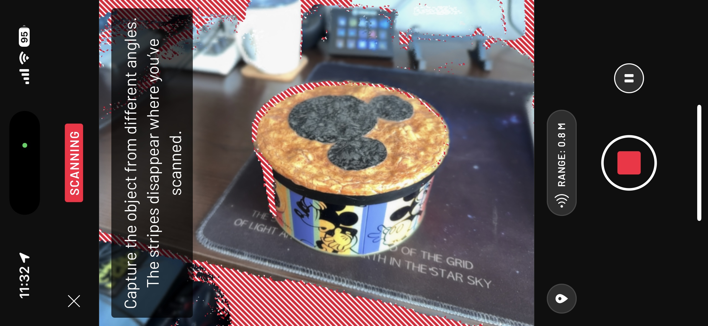
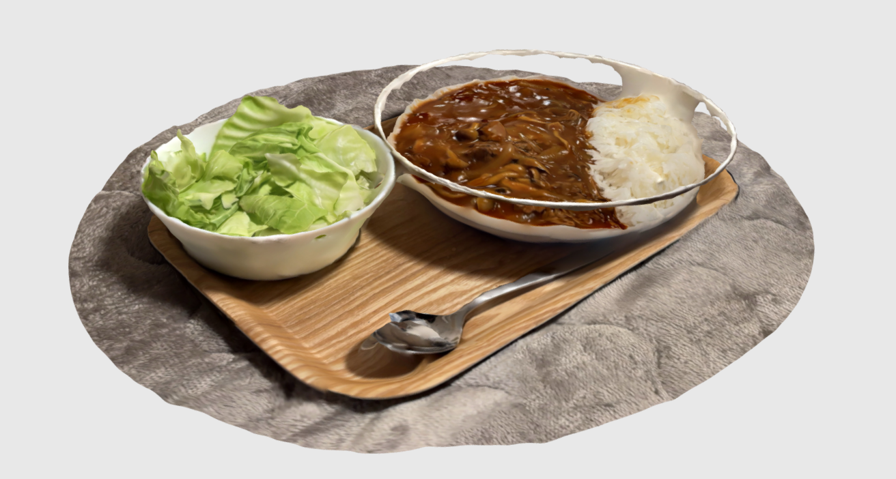
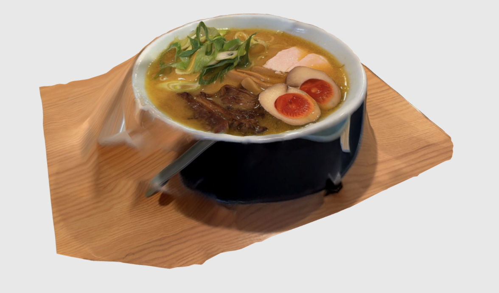
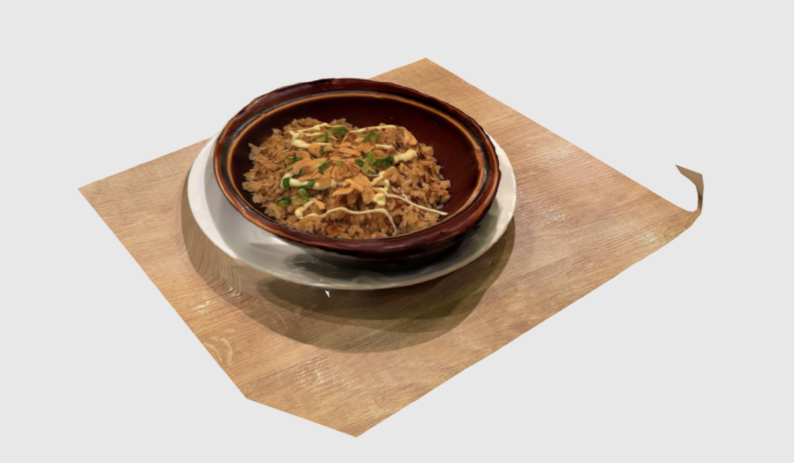

+++
author = "twoooooda"
title = "3D飯スキャンをしてみよう"
date = "2024-12-07"
description = "美味しそうですよ。"
tags = [
    "Unity",
    "日記",
]
categories = [
    "diary"
]

series = ["Themes Guide"]
aliases = ["migrate-from-jekyl"]
image = "222419.jpg"
slug="3d-meshi-scan"
+++

## この記事は？
　この記事は、[某企業アドベントカレンダー2024](https://adventar.org/calendars/10291)七日目の記事です。
飯テロにご注意ください。
***

## 3Dスキャン
　**3Dスキャン**とは、文字通り空間や物体などを3次元的に記録するものです。空間や景色を平面敵に切り取る写真と違って、記録を残す時の**周りの空間**ごと残せるというのは大きな利点だと思います。飯スキャンに限らず、例えば自室を3Dスキャンして模様替えに利用したり、文化財などを3Dスキャンしてより情報量の多いアーカイブとして後世に残すといったことへの利用が注目されています。

　3Dスキャンする手法はいろいろありますが、一般的には多視点からの物体の写真を大量に撮って、それらから立体を推測する**フォトグラメトリ**や、似た手法のNeRF、Gaussian Splatting、赤外線センサによる距離情報も使って面を推測する方法などがあります。
　立体を表現する方法にも複数あり、特に一般的なものに3つの頂点からなる平面を立体に連ねて表現するメッシュデータがあります。次点では立体を大量の特徴点で表現する点群データがあります。[[参考]](https://note.com/andpad_zero/n/n0bea3d180bc0)

　この記事では、iPhone Proシリーズと、とあるアプリを使って3Dスキャンをする方法を紹介します。

## 3Dスキャンをしてみよう
　この記事では、iPhoneアプリである[**Scaniverse**](https://apps.apple.com/jp/app/scaniverse-3d-scanner/id1541433223)を使った3Dスキャンを紹介します。このアプリは、iPhone Proシリーズに搭載されている赤外線センサである "**LiDAR**" センサを使うことで本領を発揮しますが、なくてもできます。

　スキャン方法としてはごく簡単で、スキャンしたいものの周りをiPhoneで動画を数十秒撮るようにするだけです。

実際にスキャンされたものは**Sketchfab**などのサイトで[こんな感じ](https://skfb.ly/psFrX)に共有することもできます。成果物をみると、ほんの30秒くらいのスキャン時間だったのにも関わらず、かなり精細にスキャンできているかと思います。

　いざ、飯を3Dスキャンした結果が以下です。出先でスキャンすることが多いので自宅ほど鮮明なスキャンは難しいことがありますが、どんな料理だったかを窺い知るには十分なクオリティだと思います。実際の距離情報を使っているので、各種サービスや後述するUnityなどで使う場合、実際の寸法のまま利用することもできます。

**Sketchfabリンク**
- [ハヤシライス](https://skfb.ly/pszDV)
- [ラーメン](https://skfb.ly/psF8w)
- [ガーリックライス](https://skfb.ly/psF8x)

　挙げた3Dスキャンは飯部分以外Scaniverseの機能でトリミングしていますが、実際は飯の周りもスキャンされています。ハヤシライスのスキャンでは皿部分のメッシュが溶けてしまっていますが、これは真っ白な皿だったために特徴点を掴めず、うまくメッシュを貼れなかったのだと考えられます。

## スキャンデータで遊ぼう
　3Dスキャンをすると、飯の3Dデータが手に入ります。ただの記録に使うのもいいですが、Unityなどのゲームエンジンを使うと3Dオブジェクトとして遊ぶことができます。

### ARで
　Scaiverseには、AR機能が標準で搭載されています。この機能を使うと、例えばあの日食べた飯をAR的に、ほぼ原寸大で鑑賞することができます。

 

### VRで
　次はVRです。UnityとMeta Quest2を使って、仮想空間で遊んでみました。VRなら好きな飯で部屋を満たすことだってできます。

 

 ### MRで
 　最後にMRです。同じくUnityと、HoloLens2で遊んでみました。MRはARとVRのいいとこどりだけあって、独特の楽しみ方もできそうです。

 

## さいごに
　いかがでしたでしょうか。写真で残すのももちろんいいですが、3Dデータとして残すのも実用段階に入っていると思います。皆さんもやってみてください。