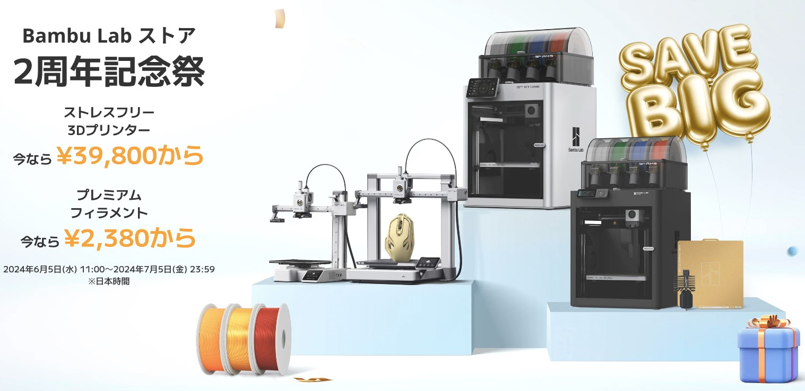

+++
author = "twoooooda"
title = "Bambu Lab A1 mini買ってみました。"
date = "2024-06-15"
description = "アヒルは付属しません。"
tags = [
    "日記",
    "ガジェット",
    "3Dプリンター"
]
categories = [
    "ガジェット"
]

series = ["Themes Guide"]
aliases = ["migrate-from-jekyl"]
image = "IMG_6765.JPEG"
slug="3Dprinter-Kattemita"
+++

## 話題の3Dプリンターがセールしてた
　ちょっと前から低価格で高精度、高速プリントができると話題になってた**Bambu Lab A1 mini**が[Bambu Lab ストア](https://jp.store.bambulab.com/)で13,000円オフの39,800円になってたので買ってしまいました。

## 開封
　開封すると、ダンボール、フォームで丁寧に梱包されたA1 miniが入っており、ヘッド部分も専用の部品で固定されていました。付属品としては各ネジを締めるための6角レンチ、フィラメント詰まり解消ツール、オイル、グリス、試験印刷用フィラメントなどが入っていました。中にはなんと置時計自作用の時計モジュールまで入っていました。

## 使う前の注意点
　中華製品あるあるですが、電源プラグが3ピンです。日本の一般家庭用の2ピンにするアダプタを付属してきませんので、別途用意する必要があります。あと印刷中はかなり揺れます。動作音自体は比較的静かですが、特に横揺れが大きいので、置く場所や振動対策に気を付ける必要があるかもしれません。私は学習机についてきた木製の頑丈なコンテナの上に置いていて、今のところ不都合はありません。

## 所感
　総合的にかなり満足度高い買い物をしたと思います。タッチパネルのインタフェースの完成度も高く使いやすいですし、インターネットに繋がるので無線経由で印刷データを送信することができます。ネットワーク経由あるいはBluetoothで、[PCのスライスソフト](https://apps.apple.com/us/app/bambu-handy/id1625671285)や[スマホアプリ](https://apps.apple.com/us/app/bambu-handy/id1625671285)と接続でき、ライトの点灯やカメラ映像の受信などもできます。
　最初の印刷をする時にだいたい行うステージの水平出しなどの面倒な作業もスイッチ一つで行ってくれて、印刷中も振動やノイズを感知し、リアルタイムで調整しているそうです。次回以降の印刷でもステージ、ヘッドの加熱、各種調整を自動でやってくれるので、本当に気軽に印刷することができます。

　Bambu Lab A1 mini、おすすめです。

