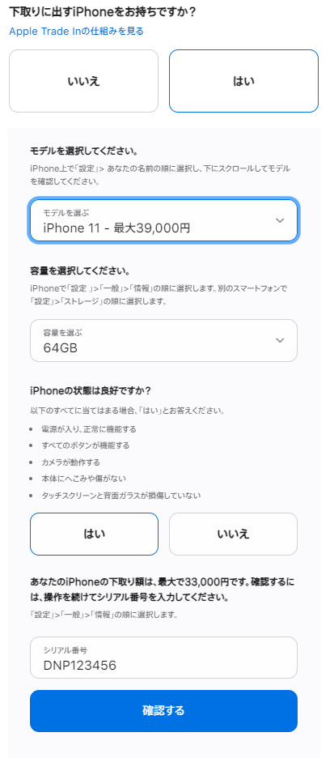
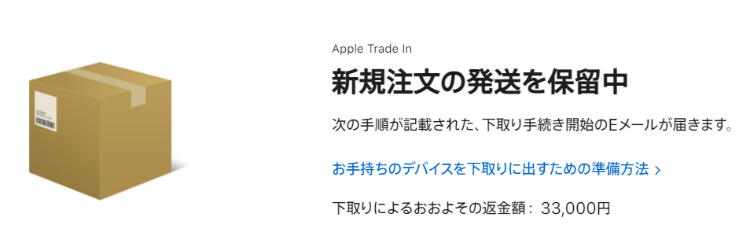

+++
author = "twoooooda"
title = "Apple公式下取りサービス「Apple Trade In」利用レビュー"
date = "2021-10-03"
description = "iPhoneの購入代金を少しでも楽に取り返すために「Apple Trade In」を利用してみました。"
tags = [
    "日記",
    "ガジェット",
    "散財"
]
categories = [
    "体験レポ"
]
+++

[前回記事](https://twoooooda.github.io/p/iphone-13-mini%E8%B2%B7%E3%81%A3%E3%81%9F%E3%82%88%E3%83%BC/)のとおり、先日発売されたiPhone13 mini を買うことにしました。幸いにして私は物持ちがすこぶる良く、2年前のiPhone11の状態もほぼ無傷だったので、Apple公式の下取りサービスである「Apple Trade In」を使ってiPhone11を下取りに出すことにしました。

## Apple Trade Inとは
前述の通り、Apple社が公式で行っているApple製品下取りサービスです。AppleがiPhone6 Plus(下取り価格約3,000円)から、iPhone12 ProMax(最大84,000円)までのシリーズを引き取り、相応の値段を購入額から割り引くというよくある感じのサービスです。iPhone6以前の機種は無料で回収されるのみとのこと。

 
 

### 利用手順
- まずはiPhoneの新規購入画面で、サービスに関係する基本的なフォームを入力します。今回はiPhone11 64GBモデルなので最大33000円で下取ってくれるようです。 
 

 

- ↑をきちんと入力して新規購入の決済を完了すると、しばらくして追加の情報を入力するためのリンクがメールで届きます。

  - このフォームでは、**自分の職業**(会社員or自営業or学生orその他 くらいざっくりしたもの)と、**本人確認書類**のアップロードを求められます。本人確認書類は、運転免許証や健康保険証、パスポート、住民票の写し、在留カード、公共料金の領収書などから2点の提出を求められます。
  - 2点のうち1点は裏面もアップロードする必要があるので、運転免許証or健康保険証はほぼ必須でしょう。

- 次に、iPhoneを回収してもらうための集荷依頼のフォームがあります。日時と時間帯を指定してこのフォームは完了です。**14日以内**にデバイスを送らないと下取りがキャンセルになるようです。

 

## 9/30 新iPhone受け取り後
iPhone受け取ったら下取りキットの発送が保留になってました。メールも来ないしちょっと心配になりました。

 

## 10/3 集荷に来てくれました
指定の集荷時間を14時～16時にしたのですが、無事15時前にヤマトさんに来ていただきました。渡すものは下取りに出すiPhone11のみで、梱包もヤマトのお兄さんがやってくれました。本当に玄関先で生の本体を渡すだけでした。

前日に集荷予定のリマインダーメールも寄越してくれました。

 

～返金待ち～

