+++
author = "twoooooda"
title = "「Looking Glass Portrait」着弾&開封レビュー"
date = "2021-10-12"
description = "Looking Glass Portraitが到着したので開封レビューです。"
tags = [
    "MyNewGear",
    "ガジェット",
    "散財"
]
categories = [
    "散財"
]

series = ["Themes Guide"]
aliases = ["migrate-from-jekyl"]
image = "IMG_3916.JPEG"
+++

こんばんは、いっとりうむです。今年の2月くらいに、クラウドファンディングサイトkickstarterでバック(お金を出して支援すること)した返礼品である「Looking Glass Portrait」がやっと届きました。他のバッカーの方は5月くらいには届いていたようですが、住所登録のフォームの入力が遅れてしまったせいで到着が今になってしまいました。

## Looking Glassとは？
端的に言うとズバリ「**裸眼で立体視可能なディスプレイ**」です。一般的な立体視ディスプレイは青色と赤色のフィルムをレンズとしたメガネや、偏光フィルタを使ったメガネをかける必要があったりしますが、Looking Glassはそういった類のものは全く必要とせず立体視が可能です。詳しい原理は[公式のドキュメント](http://docs-ja.lookingglassfactory.com/Appendix/how-it-works/)に書いてあるのでそちらを読んでもらうのが一番確実ですが、レンチキュラーレンズという特殊な構造を持ったディスプレイに横方向45視点くらいからの画像を同時に表示して、両目による視差、あるいは横に動いた時の視差を実現しています。

- 最初に世に出たLooking Glassは,、全面に巨大で重厚なアクリルの塊がついた8.9インチのディスプレイでした(購入済み)。購入当時はだいたい8万円でした。  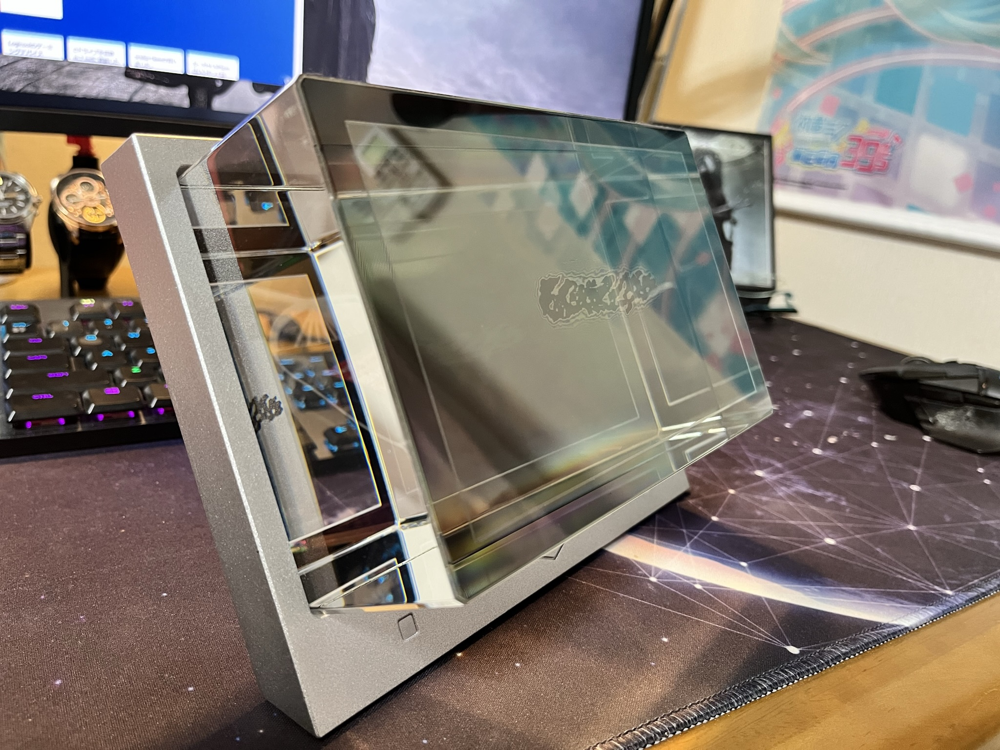 

- 初代の8インチのものがあまりに重く、場所も取るため、小型化＆薄型化&低価格化(クラファン特価で$199)した「Looking Glass Portrait」が2020年末に発表されました。

## 開封
- 製造元のLooking Glass Factory社はスタートアップながら、かなりちゃんとした化粧箱で届きました。  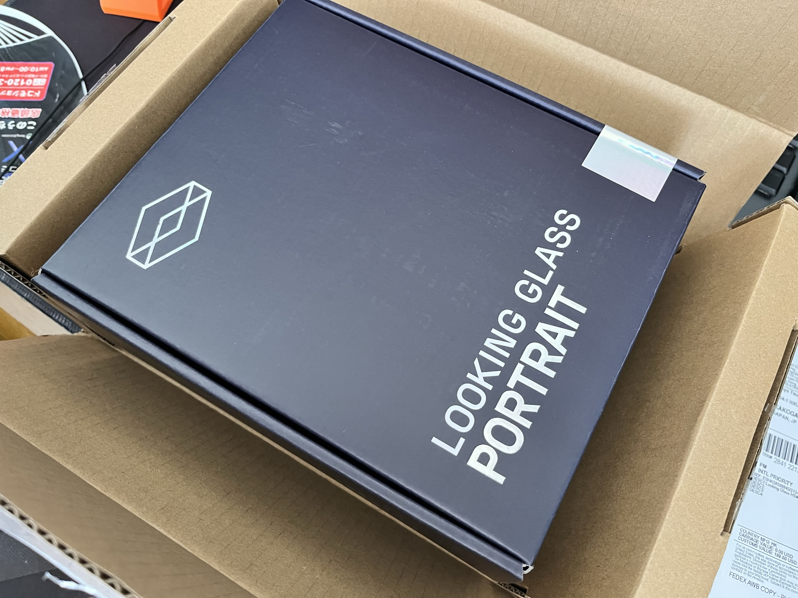 

- キャリーケース付きのプランをバックしたので、まずはそちらが顔を覗かせます。  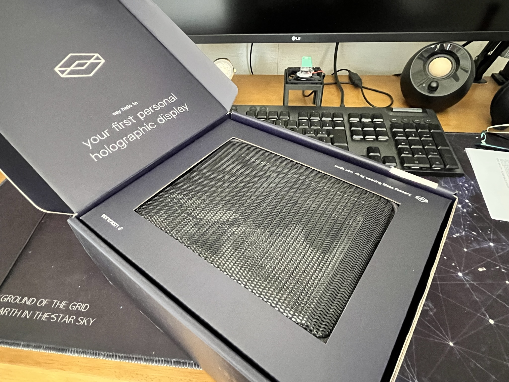 

- 本体。画面部分を見ると、先代と比べてアクリル塊が無くなっているどころか凹んでいます。  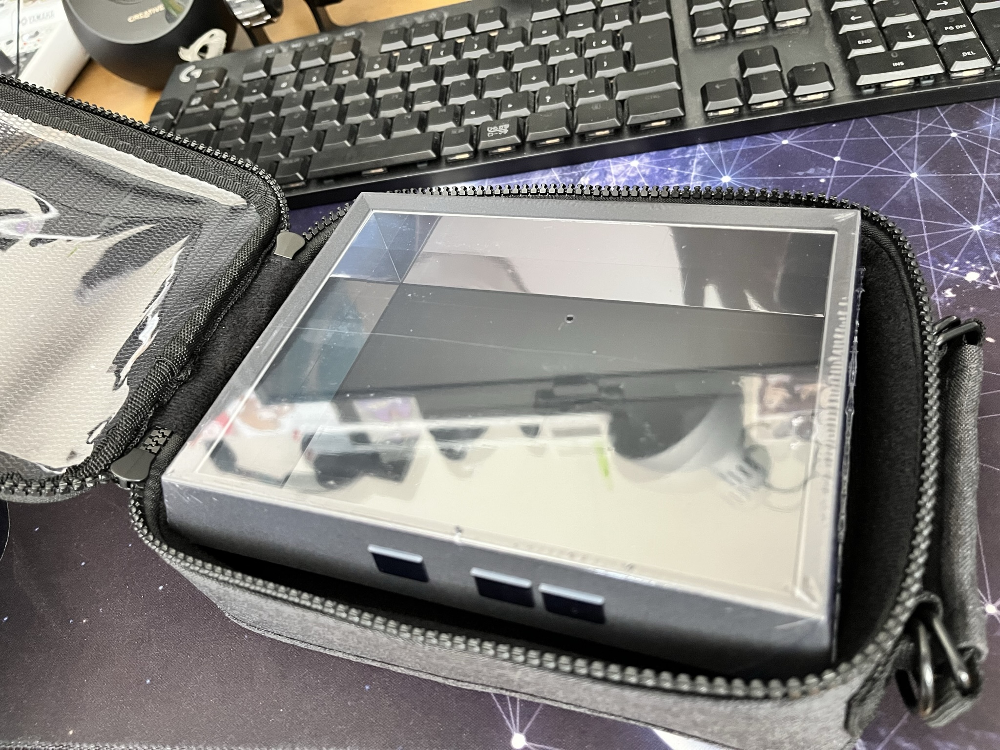   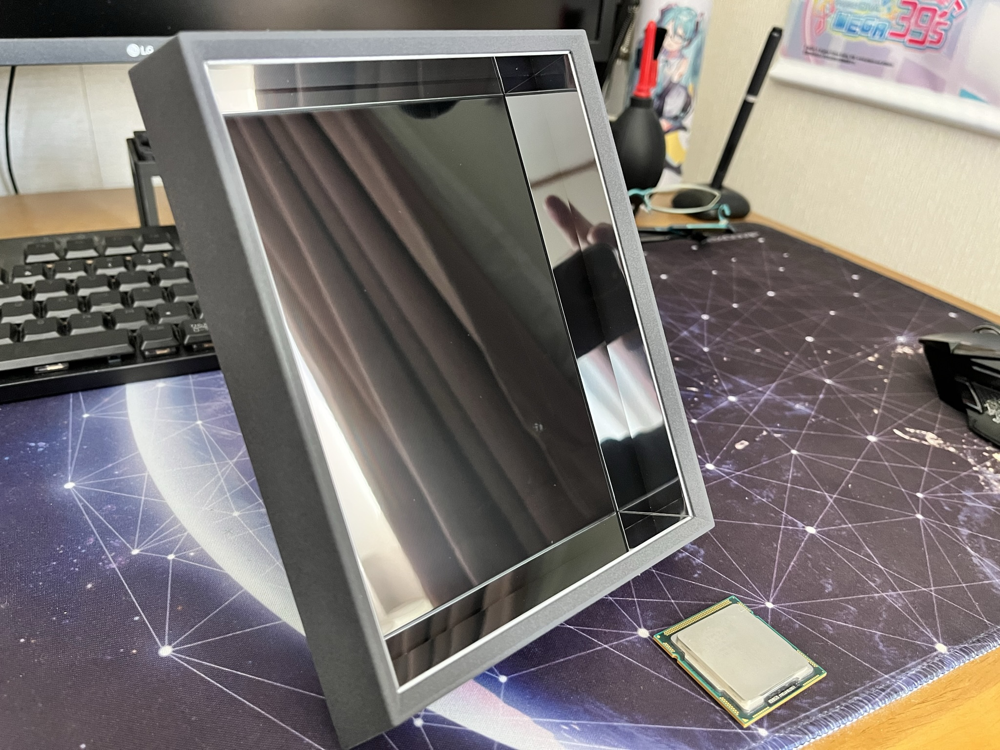 

- キャリーケースもしかっりしたオリジナルのものが付いてきました。  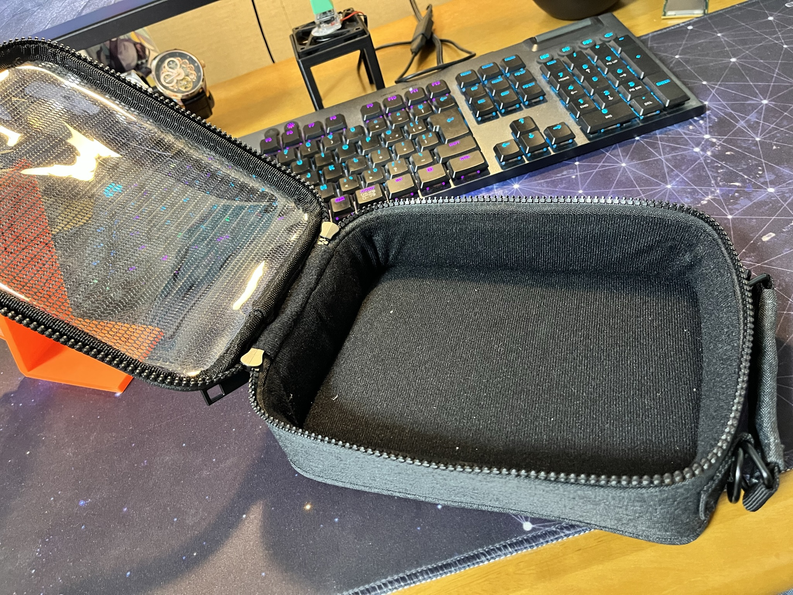 

- 付属品はHDMIケーブル、USB Type-Cケーブル、USB Type-C端子のACアダプタ(5V, 3A)、クリーニングクロス、キャリーケースに着ける紐がついてきました。紙類は簡単な説明書、サンキューカード的な奴、ステッカー。  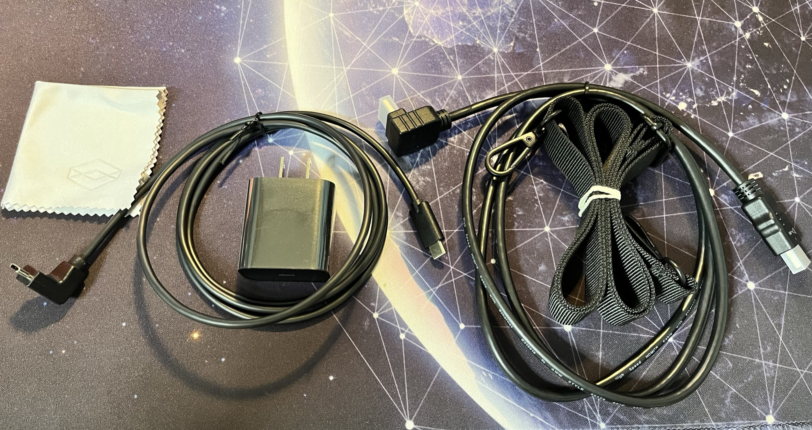   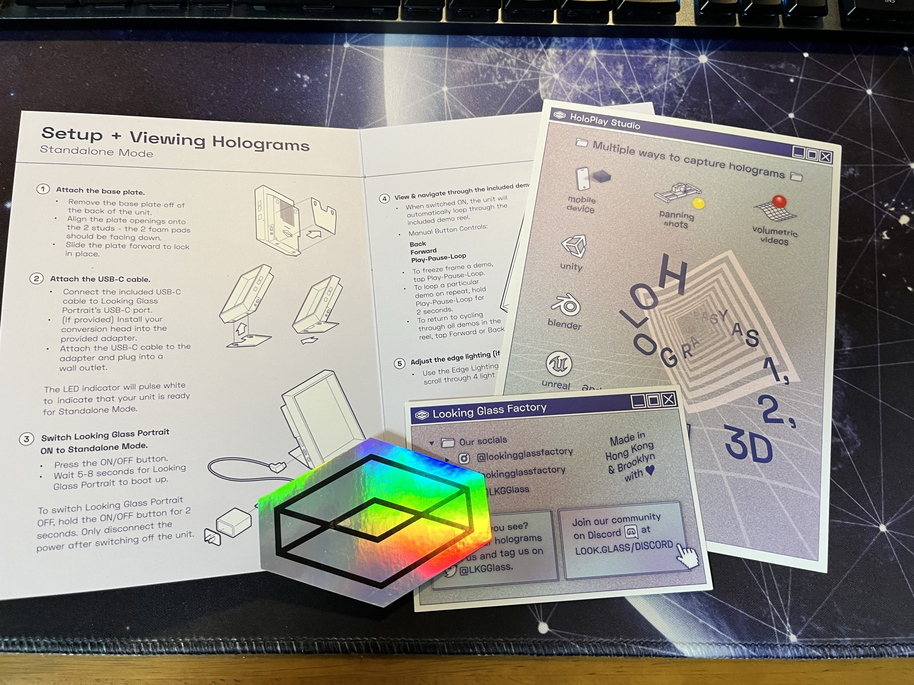

## Looking Glass Portrait
- スペックとしては、画面サイズが7.9インチ、重量660g。Rasberry pi 4を搭載しており、PCにつないでディスプレイとして使う他にも、電源に繋ぐだけで単体でデモを表示できます。

- 向かって左側面にはHDMIとUSB Type-Cポート、3.5mmオーディオOUT。右側面には電源スイッチ(上)、LED調光スイッチ(下)、デモ操作用のタッチスイッチが3つ並んでいます。  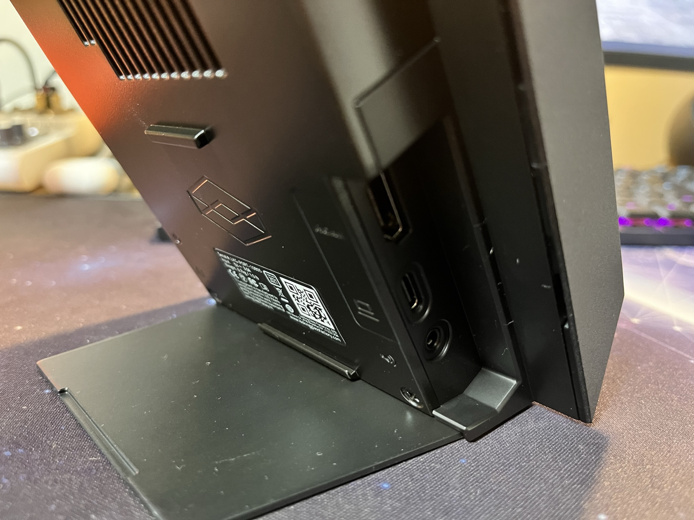   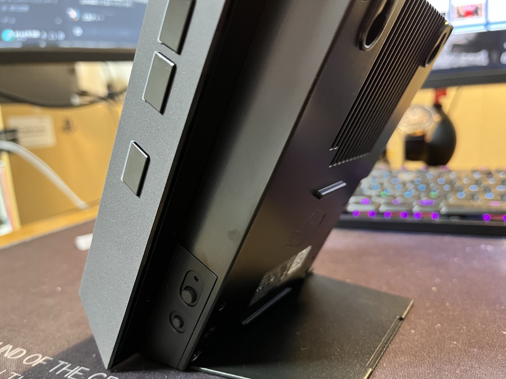 

- ラズパイ4を内部に搭載しているので、USB Type-Cポートから電源に繋ぐだけでプリセットのデモを表示できます。デモにはiPhone12 ProのLiDARセンサーを使って撮影したポートレート写真や3DCGムービーが入ってました。中にはVirtual YouTuberのキズナアイ親分のショート動画もあってビックリしました。  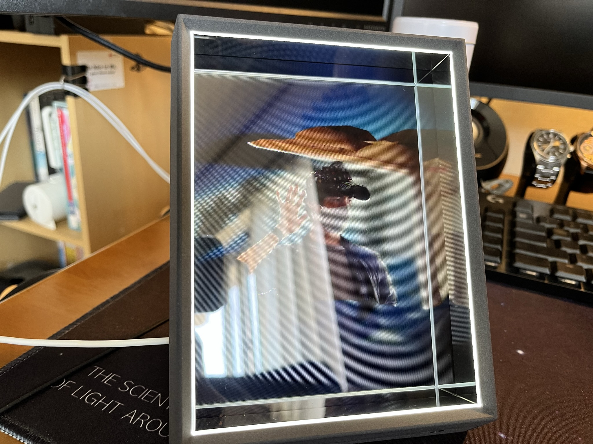   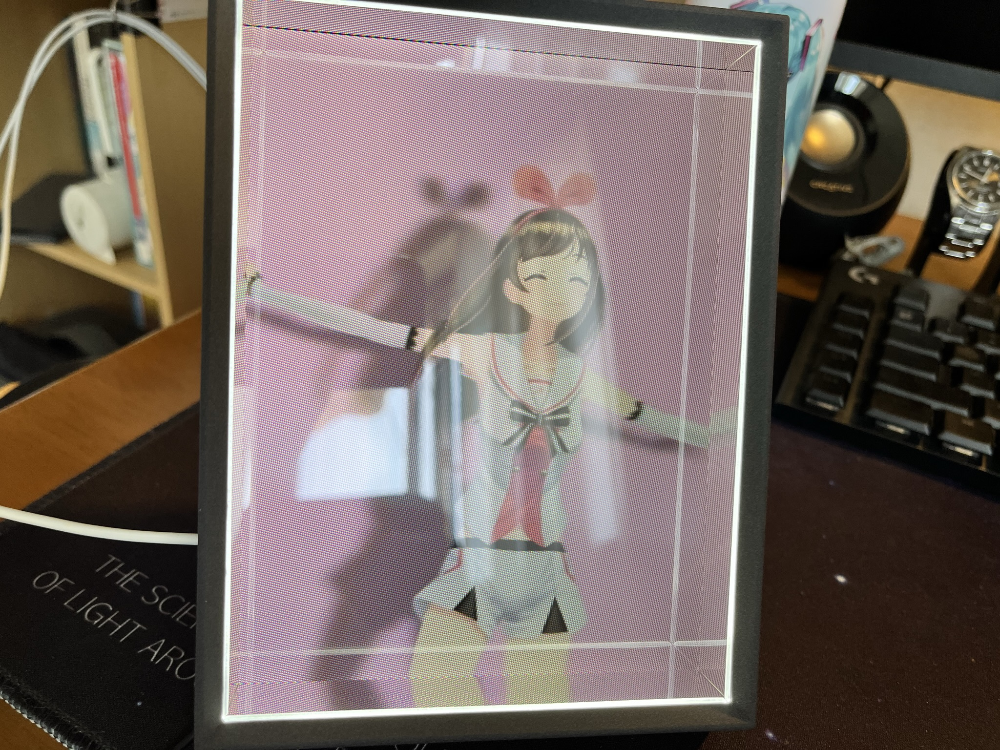 

- 推奨解像度は普段あまり馴染みのない1536×2048。数字上はフルHDよりも高精細ですが、構造が特殊なこともありフルHDモニターよりもドット感が目立ちます。見てのとおり、エクスプローラーの文字も読めません。  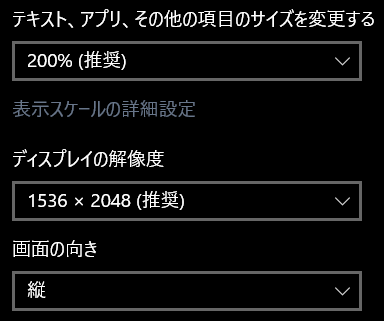   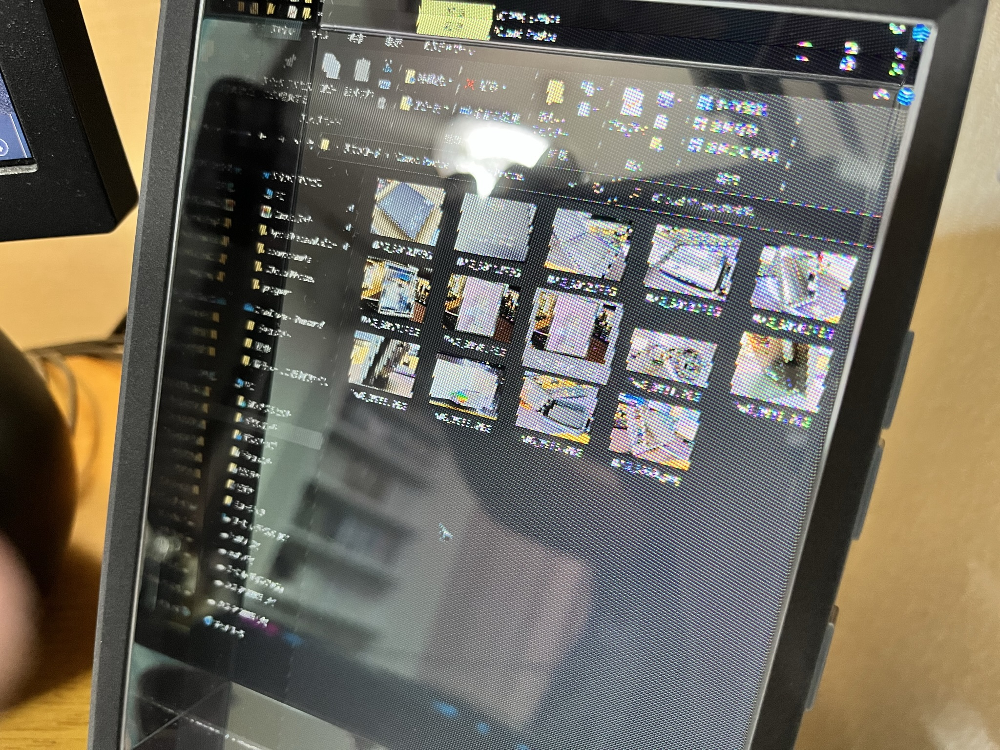 

- こればかりは画像で全く伝わらないのが惜しいですが、初代Looking Glassより小型軽量化しているのにも関わらず、遜色なくちゃんと裸眼立体視出来ています。立体視の体験的には劇的に進化したという感じは少ないですが、着実に良い製品となっています。軽くなったことにより取り回しやすくなり、何倍も使いやすくなったのではないでしょうか。手の届く範囲まで値段も下がっているので、興味がある方は購入してみても後悔しないと思います。