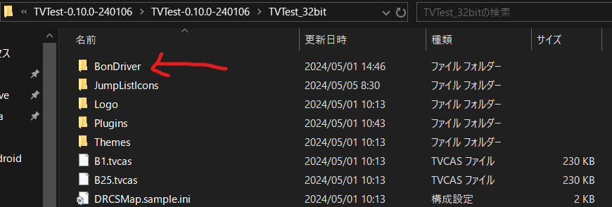
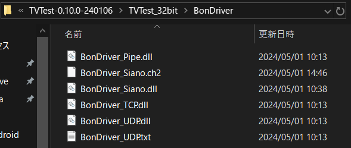
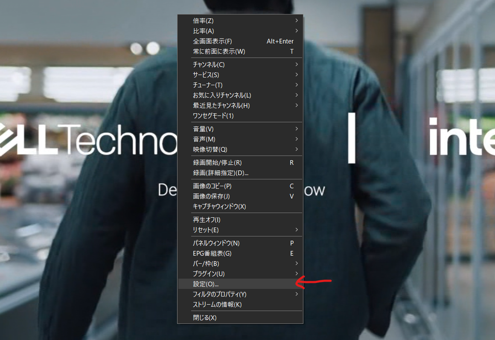
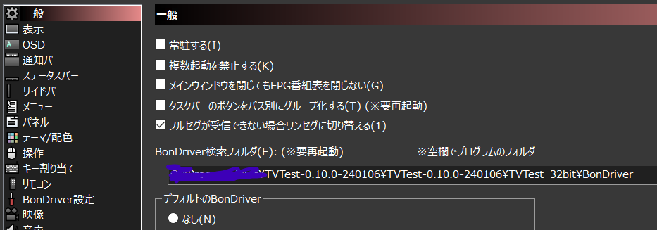
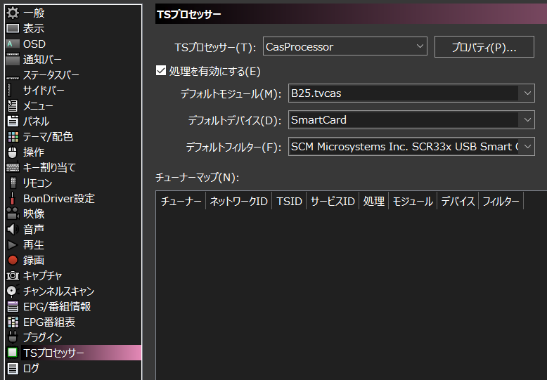
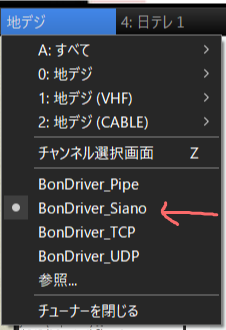
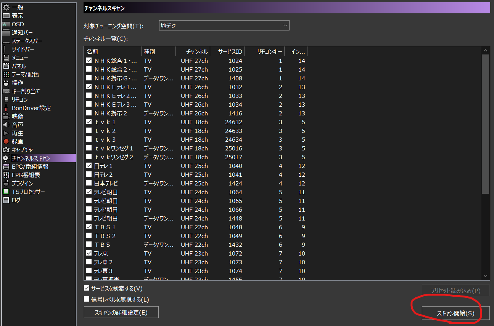
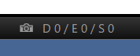

+++
author = "twoooooda"
title = "USB TVチューナーPX-S1UDを使ってテレビを視聴する最速手順"
date = "2024-05-27"
description = "PX-S1UD V2.0を使ってテレビを視聴する最速手順です。"
tags = [
    "日記",
    "ガジェット",
    "備忘録"
]
categories = [
    "diary"
]

series = ["Themes Guide"]
aliases = ["migrate-from-jekyl"]
image = "0f3010e5fa0dcb1600eb6a88167d6465.png"
slug="PX-S1UDandTVTest"
+++

基本的には **[先駆者様のサイト](https://blog.tsukumijima.net/article/tvtest-usage/)** をかいつまんだだけです。詳しい&正確な情報はそちらを参考にしてください。

## 用意するもの
- USB TVチューナー **[PX-S1UD V2.0](https://amzn.asia/d/7nwX0jt)**
    - 今買えるものはだいたいV2.0な気がします。

- B-CASカード
 	- 私はぶっ壊れたnasneから奪ってきました。

- USBカードリーダー
 	- [NTTのやつ（SCR3310V2.0）](https://amzn.asia/d/b5PTsTL)が多分一番有名で安定、この記事でもこのリーダーを使っている前提で進めます。

- Windows PC
- テレビ用同軸ケーブル
 

## ソフトウェアのダウンロード・インストール
- PX-S1UDのドライバは[こちら](https://www.plex-net.co.jp/download/)

- カードリーダー（SCR3310V2.0）のドライバは[こちら](https://www.ntt.com/business/services/application/authentication/jpki/download10.html)

- [BonDriver-Siano](https://www.axfc.net/u/2503550)
    - PX-S1UDでテレビを見るために別途導入が必要なドライバです。BonDriverは他にも種類がありますが、私の環境ではこれしか動きませんでした。後述。

- **TVTest**
    - Windowsでテレビを見るためのソフトウェアです。これも私の環境では32bit版しか動きませんでした。ビルド済みのものは[こちら](https://blog.tsukumijima.net/article/tvtest-usage/#toc3)にあります。

## TVTestの準備
### 解凍・フォルダの移動
　ビルド後のTVTestをダウンロードしてきたら、解凍して任意の場所に移動させます。この時、 **C:\Users・C:\Program Files 以外のフォルダ** に移動させないといけないそうです。

### DirectShow フィルタのインストール
　Windows 10 では、日本のテレビ放送の映像コーデックである MPEG-2 をデコードして再生するのに必要な Microsoft DTV-DVD Video Decoder が標準ではインストールされていないそうなので、TVTest の作者さんが用意してくれているものでインストールします。[詳しくは](https://blog.tsukumijima.net/article/tvtest-usage/#toc5)

 

TVTest フォルダ内にある [* filter-install.jse] を、管理者権限で実行してください。

### BonDriverのセットアップ
　環境や用途によってはBonDriverを複数種類使う可能性も考えられます。なのでTVTestの下に別途BonDriverというフォルダを作って、そこで一括管理する方法が推奨されています。

### TVTestのセットアップ
#### 初期設定
　最初に起動すると、設定のポップアップウィンドウが出てきます。この設定はあとで変えられるので適当でも大丈夫です。
- BonDriver … 今後 BonDriver 検索フォルダを変更するため今は空のままにしておく（後述）
- H.264/AVCデコーダ … **自動** のままで OK
- H.265/HEVCデコーダ … **自動** のままで OK
- MPEG-2デコーダ … **TVTest DTV Video Decoder** に変更する
- 映像レンダラ … **EVR** に変更する
- 録画ファイルの保存フォルダ … TVTest で録画した番組の保存先フォルダをここで設定可能

#### BonDriverの参照
　前述したBonDriverフォルダをTVTestから参照します。TVTestウィンドウ内の無を右クリックして設定を開きます。
すると、**一般**の中に**BonDriver検索フォルダ**の項目があるので、先ほど作ったBonDriverフォルダを指定します。

 

__ここで一度TVTestを再起動しておきましょう。__

 

#### TSプロセッサー
　TVTestでテレビを見る場合の一番大事な設定といっても過言ではないのが、一番下にある **TSプロセッサ** の項目です。ここが設定されていないと上手くテレビが映りません。↓の画像のように設定します。

#### とりあえず見れるはず
　ここまで設定すれば、TVTestのウィンドウの左下から適切なBonDriverを選ぶだけでとりあえずテレビが見れるはずです。

## TVTestを使う
### チャンネルスキャン
　このままでは不便なので、設定からチャンネルスキャンをしましょう。これが正常に完了すると、TVTestウィンドウの左下の<チャンネル>のプルダウンからチャンネルを選択して、番組を視聴することができます。

### エラー表示
　テレビが映らない、何かがおかしいと思ったら、下のエラー表示を見てみるといいかもしれません。特に、B-CASカードによる復号ががうまく動いていない時は **S** の値が爆増していくので、目安程度にはなります。

 

とりあえず以上です。これはあくまでPX-S1UDとPCでテレビを見るための最短手順ですので、TVTestの設定などを練ればもっと便利に使えるはずです。
