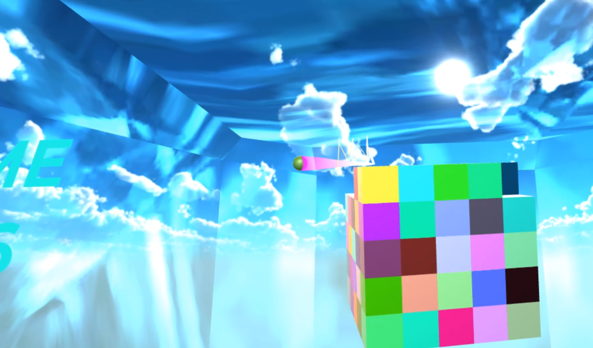

+++
author = "twoooooda"
title = "自作VRゲーム「VRブロック崩し」で工夫したことすべて"
date = "2024-12-20"
description = "今夜は語ります。"
tags = [
    "Unity",
    "C#",
    "知見",

]
categories = [
    "Unity"
]

series = ["Themes Guide"]
aliases = ["migrate-from-jekyl"]
image = "110459.jpg"
slug="vr-block-break"
+++

## この記事は？
　この記事は、[某企業アドベントカレンダー2024](https://adventar.org/calendars/10291)最終日の記事です。
今回は拙作のVRゲーム「VRブロック崩し」を制作するにあたって考えていたこと、狙い、工夫点などを語っていこうと思います。
***

## VRブロック崩しとは
　そもそもVRブロック崩しとは、私が所属する大学にて、2023年冬に開催された大学祭用に制作したVRゲームです。
プレイヤーはVR空間内の狭いスペースの中で、テニスの壁打ちをするようにボールとラケットでブロック崩しをするというものです（後述）。
ステージとしてはスタート前のロビー的なエリア、1stステージ、2ndステージ、結果発表エリアから構成されています。
大学祭当日はホワイトボードにその日のベストスコアを記録して競ってもらったり、一定以上のスコアを取った人には特典で
うまい棒をあげるなどして、かなり盛り上がっていただけました。

実際に制作したゲームが↓になります。

 

## 開発経緯とコンセプト
　そもそもなぜこのゲームがこの形に落ち着いたのかを話すには、2018年の同じく大学祭に遡ります。2018年の
大学祭にて初めてVR機器をレンタルしてBeat Saberを体験展示したところ大変好評で、展示する側も楽しかったので、
次回はゲームを自分で作って展示したいという欲がわいてきました。

　VRゲームを作るにあたってまず最初に気を付けて、最後まで大事にした点が以下のようなものです。

- 体験者が絶対に**酔わない**
    - 少しでも酔うと満足度が大きく損なわれるから
- **必要最低限の操作説明**でプレイできる
- **端から見ている人**も楽しめる
    - 傍観者が楽しめないというVRの弱点をなんとかしたかった
- 体を動かしてプレイする
    - 体を動かさないならVRである意味がないと思ったので
- **現実ではできないような体験**ができる
    - せっかくの*Virtual Reality*なので

以上の大事にしたいポイントを踏まえたうえで、VRゲームのコンセプトを決めていきました。

- 酔わないようできるだけ**体験者を動かなさい**
    - 例えば車に乗るコンテンツや空を飛ぶようなコンテンツにはしない
- 視界をミラーリングしているモニターに楽し気でカラフル、かつ**変化が激しい画**を映したい
- 体を動かす→スポーツ→コントローラーを使えるような個人競技モチーフが相性がいい
- 普段の視界からはかけ離れたゲームらしいVR空間デザイン

　特に「__現実世界ではそんなに行うことができない__」、「__端から見ていても楽しい__」という点を重視したかったので、
今回は **__「破壊」__** をテーマに据えることにしました。物を自由に壊すことは根源的な楽しさがありますし、ミラーリングの画面にも派手でダイナミックな画を出せそうです。

　そして破壊をテーマにしたゲームといえば **「ブロック崩し」** です。加えて **「体を動かす」** 要素などを考慮して、
**「テニスのようにボールを打ち返して3次元ブロック崩しをする」** というような形を目指すこととしました。

## 1作目
そんなことを考えながら手探りで作った私のVRゲーム処女作が↓の作品になります。

 

　2019年の大学祭でこのVRゲーム処女作を展示したところ、これもまた大変好評で、私の中でかなり大きい成功体験になっています。

　まずこのゲームはBeat Saberのように、プレイヤーは**空間を移動しません**。また、背景が動くと人は動いていると勘違いしてしまうので
背景も一切動かしません。背景に相当するような巨大なオブジェクトも登場しませんし移動しません。

　視界ミラーリングをしているモニターには、目の前に浮かんでいるカラフルなブロックが次々に音を立てて崩れて（はじけて？）いく爽快感があります。実際に大学祭ではかなりの人がミラーリングのモニターに釘付けになっていましたし、客寄せにも一役買ってくれました。

　他の細かい工夫点などは追々説明します。

## 2作目
　時は経って2023年、コロナ禍も鳴りを潜め大学祭のリアル開催が再開されたので、4年前に作ったVRブロック崩しをリメイクして再度体験展示しようと考えました。そうして完成したのがリメイク版の2作目になります。コンセプトや基本設計はそのままに、ビジュアルの部分やシステム面で進化させています。

　次項からは1作目や2作目で工夫したポイントを、2作目を例にしながら細かく説明していきます。

## 工夫ポイント
### 全体のデザイン
　1作目の時はとにかく幻想的な感じにしたくて、雲の上や宇宙空間に浮かんだステージというイメージで作りました。ステージには宝石用だったシェーダーをあてて、ガラス板、水晶のようなな感じにしています。ですが、壁が透明故に反射のタイミングがわかりづらかったり、どうしてもチープなビジュアルになってしまいました。ブロックが崩れた時のエフェクトは「立方体が崩れてさらに立方体の破片が飛び散る」というイメージのエフェクトにしています。

　2作目はうってかわって室内モチーフに変え、ネオンサインのような映える光源を置いてライティングに気を配りました。結果として、大仰な背景を使わずともリッチな画面を作れていると思います。ブロックにも気を遣い、1作目ではランダムな色でのベタ塗りだったのに対し、2作目では色を固定しリッチなシェーダーをあてています。崩れた時の破片も、**実際に立方体が砕けたときの破片**を出すようにしてビジュアル面での強化を図りました。

### ロビーエリア
　ゲーム開始前のロビーエリアでは、主に以下の狙いがあります。

- プレイヤー、傍観者ともにゲームの雰囲気がわかる
- このゲームはラケットとボールで何かをするというのがわかる
- ラケットはボールを打てて、ボールでブロック崩しをするんだなというのがわかる

　このゲームはラケットがコントローラーに直接紐づいていて、ボタン操作が一切ありません。なので、このロビーエリアが実質的な操作説明兼、チュートリアルステージになっています。

### 1stステージ
　1stステージはシンプルな3次元ブロック崩しです。ステージの形状を俯瞰すると、三角形に近い、適度に面取りされたモデルになっています。VR視点だとわかりづらいかも知れないですが、実は手前から奥にかけてかなり広がっています。これは、奥で反射したボールが自然にブロックの方めがけて反射するように工夫した結果です。また手前がすぼまっていることで、体から遠すぎてボールを返せないということを防いでいます。

　ゲーム性のために、**ボールの挙動**に関してもかなり工夫しています。細かいスクリプトは紹介しませんが、以下のような調整が加わっています。必要以上に返すのが難しいボールを減らしたり、「なかなか手前に返ってこなくて暇」という状況を減らすための調整が多いです。
- 一定ラインより奥で反射した場合、ブロックの塊の中心に向かいやすい
- 一定ラインより奥である回数以上反射すると、プレイヤー側に向かわせる力がはたらく
- 一定ラインより手前で反射した場合、プレイヤーの体に向かいやすい
- 一定ラインより奥から反射せずプレイヤーに向かってきた場合、曲がりながらプレイヤーに向かってくる

　動画を見ていると気づくかもしれませんが、ボールは**反射を繰り返すと少しずつ速度が上がって**いきます。プレイヤーはゲームの中でだんだんとゲームに慣れて（飽きて）いくので、変化のためにこういう調整もしています。ボールが埋まっているブロックが崩れるとボールが増えていくのも、プレイと見た目に変化をつけるためです。

### ステージ遷移
　1作目の時はステージの遷移時にUnityのscene（ひとつの独立した空間みたいなもの）を切り替えていました。しかし、この方法だと、遷移する瞬間にノイズとともに画面がほんの一瞬止まってしまうという問題がありました。これを受けて、2作目では同じsceneの中にロビーエリアからスコア発表のステージまで詰め込んでいます。

　2作目のステージ遷移の仕方は少しこだわりました。「**破壊**」がテーマのVRゲームなので、もういっそ**ステージごと壊れれば面白いのでは** と思いました。さっきまで自分がいたステージが吹き飛んで2ndステージが現れればこれ以上ないダイナミックな変化になりますし、**「これから何が起こるんだ！？」というワクワク感**を与えながら次のステージに進ませることができます。自分がいたVR空間が壊れて次のVR空間へ行くという、入れ子構造みたいなメタ的表現もしたくて作ったみたいなところもあります。一瞬の出来事でかつ地味ですが、個人的にはこのゲームのかなり好きな部分です。

### 2ndステージ
　1作目に関して、2ndステージは1stステージとほぼ同一です。2作目の2ndステージは1stステージから大きく変えています。
　新しい2ndステージは、ブロックの塊が「敵」として登場しボールをこちらに放ってきます。そして1stステージの同じボールを打ち返し続けるシステムとは違い、**大量のボールをさばききるゲーム**に変貌します。これは1stステージのゲーム性を引き継ぐとだんだん単調になり、飽きてしまうという問題があったからです。

　ボールはラケットに当たると弧を描いて飛んでいき、どれかのブロックには必ず当たります。なのでプレイヤーは「どう打ち返すか」を気にする必要はなく、「ただただ打ち返す」ことに集中できるという設計にしています。

　敵が放ってくるボールは、あらかじめ設定したタイミング、発射口から発射されます。が、どんな軌道を描くかはある程度ランダムです。タイミングや発射口の設定は最初は難易度低めで始まりますが、徐々に発射間隔が縮まり、同時発射数も多くなっていきます。このタイミングと発射口を決められるようになったおかげで、細かく難易度の調整ができるようになりました。

　2ndステージで外せない要素として、「**特殊ボール**」があります。動画の後半に登場する、青色と赤色のブロックから出現するボールです。これらのボールは挙動こそ違えど、一度に多くのブロックを壊すことができるアイテム的な立ち位置です。これもゲームに変化をつけるための施策で、かつ「**いっぱい壊れてなんだか気持ちいい**」というゲームの根源的な面白さを狙ったシステムです。私は、ゲームとは「**気持ちよさ**」とそれによる「**脳汁**」が本質であると思うので、このシステムはかなりその点を意識して実装しました。

### BGM
　BGMはさすがに自作していません。インターネットの海でたまたま見つけた激オシャレ曲を拝借して使っています。曲の長さもちょうどよく、制限時間を使い切ったとほぼ同時に曲も終わるようにタイミングを調整してゲームを作っています。みなさんも是非原曲様を聞いてみてください。

いつかBGMまで自作したいですね。
- [1stステージ](https://soundcloud.com/the-musical-ghost/ghost-stranger-love-future-bass?si=a15ae87f195644d99269126eca5a9806&utm_source=clipboard&utm_medium=text&utm_campaign=social_sharing)
- [2ndステージ](https://soundcloud.com/the-musical-ghost/deltarune-hip-shop-drum-bass?si=26f8feda04884b5b8fe7ca203b757751&utm_source=clipboard&utm_medium=text&utm_campaign=social_sharing)

## さいごに
　いかがでしたでしょうか（疲弊）改めて工夫点を洗い出して言語化してみるとかなりの量になってしまいました。しかしまだまだ語れるくらい、このゲームは**私の自信作であり、胸を張って面白いゲームであると言えます。** このゲームの制作は間違いなく私の中で大きな成功体験として残り続けることでしょう。