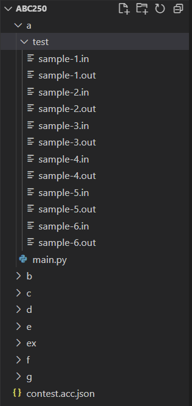

+++
author = "twoooooda"
title = "atcoder-cliを導入してみた"
date = "2022-05-20"
description = "最近AtCoderデビューしたので、便利そうなツールであるatcoder-cliというものを導入してみました。"
tags = [
    "日記",
    "知見",
    "備忘録",
    "プログラミング"
]
categories = [
    "diary"
]

series = ["Themes Guide"]
aliases = ["migrate-from-jekyl"]
image = ""
slug="Introduce-atcoder-cli"
+++

## いきさつ
　ここ最近、諸事情あって競技プログラミングで有名なAtCoderに参戦したのですが、AtCoderのwebページでポチポチコーディングするのも、別のエディタで書いてコピペするのもなんだかなぁという感じだったので、友人が使っていた**atcoder-cli**というものを導入して使ってみることにしました。なお、この記事は以下の参考文献から大いに引用しています。  
<br>  
<br>
**参考文献**  
- [AtCoder 環境構築 for Python](https://scrapbox.io/hitech/%F0%9F%8F%83_AtCoder_%E7%92%B0%E5%A2%83%E6%A7%8B%E7%AF%89_for_Python)  
- [コマンドラインツールatcoder-cliを公開しました（作成者様のサイト）](http://tatamo.81.la/blog/2018/12/07/atcoder-cli/)  
- [atcoder-cli チュートリアル（作成者様謹製のチュートリアル）](http://tatamo.81.la/blog/2018/12/07/atcoder-cli-tutorial/)
<br>  


## atcoder-cliとは？
　atcoder-cliとは、コンソールから短いコマンドを打つだけで問題の提出のみならず、使用する各言語に合わせたテンプレートの自動展開、作業フォルダ、ファイルの整理、テストケースの自動ダウンロード、検証などを簡単に行えるツールです。この記事では、基本的に**Python**でAtCoderに参戦することを前提に進めていきます。


  
## 導入方法
　基本的には[さっきのチュートリアル](http://tatamo.81.la/blog/2018/12/07/atcoder-cli-tutorial/)に従ってatcoder-cliと、セットでほぼ使うであろう **online-judge-tools**も一緒にインストールします。ちなみに、atcoder-cliはJavaScriptのパッケージマネージャであるnpmでインストールするので、npmが入っていない方はそちらを先にやってしまいましょう。  
[Node.js・npmのインストール](https://dev.macha795.com/windows10-node-js-npm-install/)
  
### 環境
| Python（Anaconda） | 3.8.8  |
| ------------------ | ------ |
| pip                | 22.0.4 |
| npm                | 6.14.6 |

### インストール
　online-judge-toolsとatcoder-cliのインストールには、以下のコマンドを実行します。
```
 > pip install online-judge-tools
 > npm install -g atcoder-cli
 ```
  

そして、以下のコマンドが使用できればインストールされています。
```
> acc -h
```  
  
<br>

### ログイン
　atcoder-cliとonline-judge-toolsの両方ログインする必要があります。以下のコマンドを叩いた後にAtCoderのユーザー名とパスワードを入力します。まずはonline-judge-toolsの方から。
```
> oj login https://atcoder.jp/
```
次にatcoder-cliの方にログイン。
```
> acc login
```
ここで、Linux等のCUIに普段から触れていると慣れているかもしれませんが、パスワードを入れる時に一見して入力できていないように見えるかもしれません。が、見えないようになっているだけで入力できています、大丈夫です。
  

### Configファイルの編集
　問題を解くときに、毎回main.pyの作成や問題用ディレクトリを作るのは面倒なので、自動化します。そのためにConfig.jsonを編集します。まずはConfigの場所の確認から。
```
> acc config-dir
C:\Users\<username>\AppData\Roaming\atcoder-cli-nodejs\Config
```
環境によってファイルの場所はまちまちになるかと思います。ファイルを開いて、以下みたいな感じに`"default-test-dirname-format"`と`"default-template":"python"`を変更します。


{
    "oj-path": "C:\\ProgramData\\Anaconda3\\Scripts\\oj.exe",
    "default-contest-dirname-format": "{ContestID}",
    "default-task-dirname-format": "{tasklabel}",
    "default-test-dirname-format": "test",
    "default-task-choice": "inquire",
    "default-template": "python"
}


次に、上のConfig.jsonがあった`Config`フォルダに`python`フォルダを作り、その中に`main.py`と`template.json`を作ります。`main.py`の中身は空でも大丈夫で、`template.json`は以下。


 {
     "task": {
         "program": [
             "main.py"
         ],
         "submit": "main.py"
     }
 }


## 使ってみる
### 解答用フォルダ作成
　ようやく使用法編です。今回は`C:\Users\<username>`の中に`atcoder`というフォルダを作り、その中で作業することとします（ここは自由です）。問題は仮にabc250のa問題を解くとしましょう。
```
> cd atcoder
> acc new abc250
```
`> acc new abc000`でその回の解答用フォルダとテストケースのダウンロードが可能です。すると、以下のように問題のリストが表示され、Spaceキーで問題の選択、Enterキーでフォルダ作成ができます。aキー -> Enterで全問を一括で選択できます。
```
abc250/contest.acc.json created.
create project of AtCoder Beginner Contest 250
? select tasks (Press <space> to select, <a> to toggle all, <i> to invert selection)
>(*) A Adjacent Squares
 ( ) B Enlarged Checker Board
 ( ) C Adjacent Swaps
 ( ) D 250-like Number
 ( ) E Prefix Equality
 ( ) F One Fourth
 ( ) G Stonks
(Move up and down to reveal more choices)
```
仮に全選択すると解答用フォルダはこんな感じになっているかと思います。a問題を解くときは、`a`フォルダにある`main.py`にコードを書いていきます。
 

### 解答、テストケース検証
　`main.py`に解答を書き終えたら、テストします。コンソールから`a`フォルダに移動して、以下を実行します。
```
> cd abc250/a
> oj t -c "python main.py"
```
すると、テストケースの検証結果が返ってきます。
```
C:\Users\<username>\abc250\a> oj t -c "python main.py"
[INFO] online-judge-tools 11.5.1 (+ online-judge-api-client 10.10.0)
[INFO] 6 cases found
[WARNING] GNU time is not available: time

[INFO] sample-1
[INFO] time: 0.065499 sec
[SUCCESS] AC

[INFO] sample-2
[INFO] time: 0.050322 sec
[SUCCESS] AC

[INFO] sample-3
[INFO] time: 0.049653 sec
[SUCCESS] AC

[INFO] sample-4
[INFO] time: 0.051948 sec
[SUCCESS] AC

[INFO] sample-5
[INFO] time: 0.046560 sec
[SUCCESS] AC

[INFO] sample-6
[INFO] time: 0.046376 sec
[SUCCESS] AC

[INFO] slowest: 0.065499 sec  (for sample-1)
[SUCCESS] test success: 6 cases
```
いい感じにACが出てていい感じですね。

### 提出
　テスト結果がいい感じだったので提出します。
```
> acc submit main.py
```
提出に成功すると、自動的にAtCoderのwebページがブラウザで開き、判定されます。そこでACをもらうと晴れて解答完了です。お疲れ様でした。

### 問題追加
　例えば、4.1章でa問題のフォルダのみを作成したけど後にb問題以降も解きたくなったとき、`abc250`のフォルダに戻り、``acc add``で追加ができます。
```
> cd ..（一つ上の階層に戻る）
> acc add
```
そうすると、同じような問題選択画面が表示され、任意の問題を追加できます。