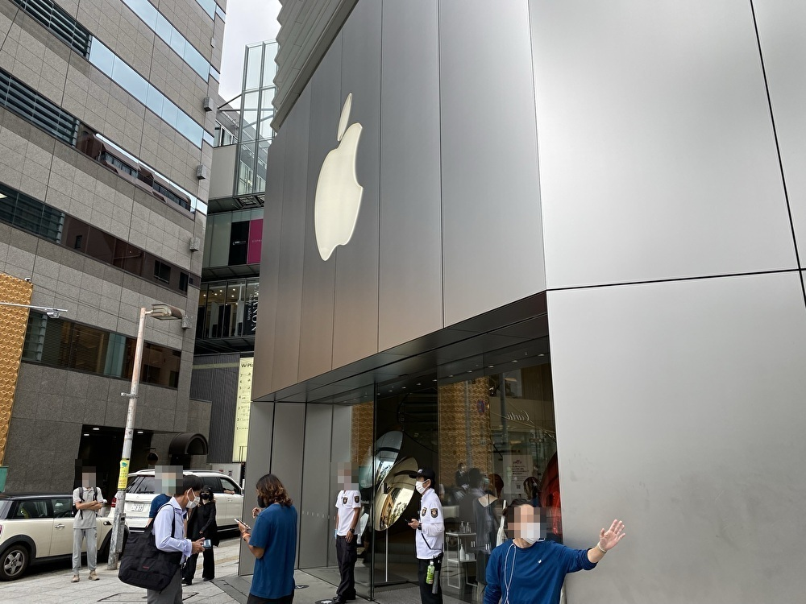
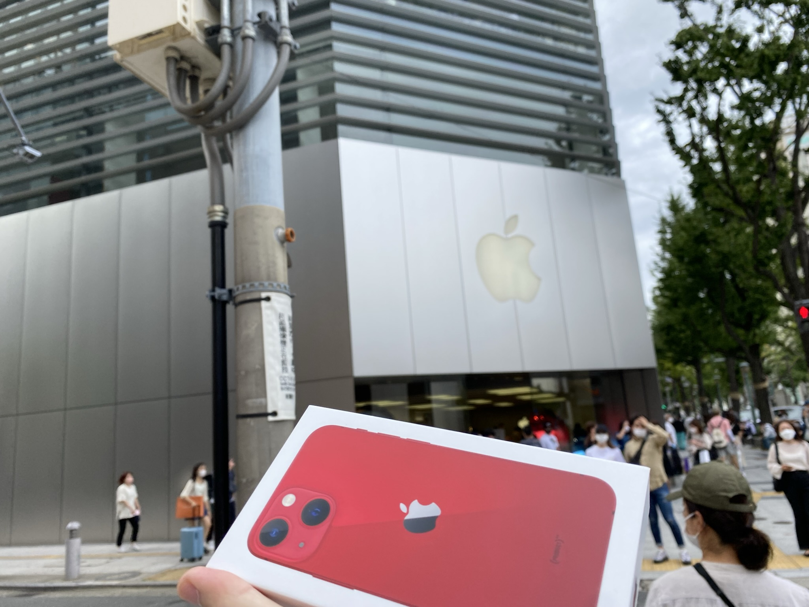
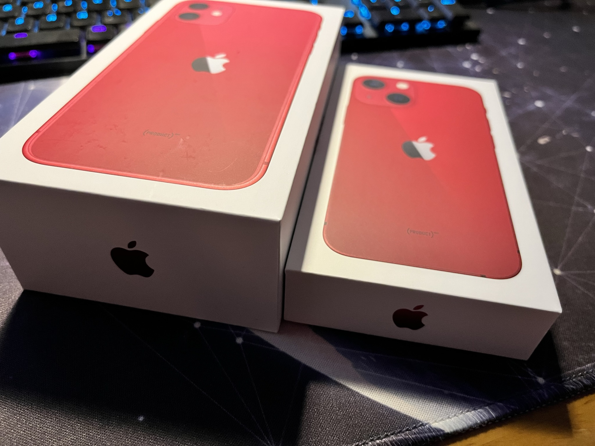
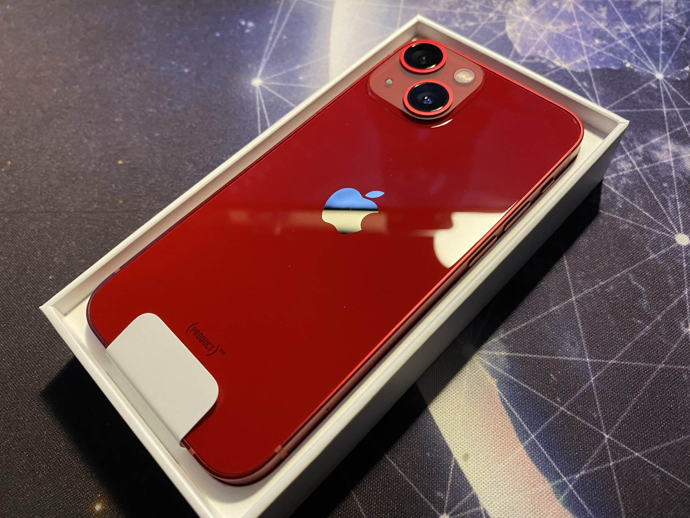
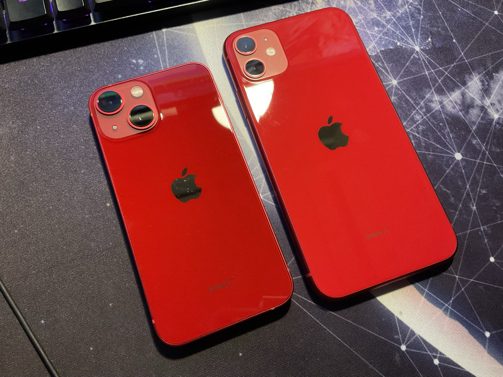
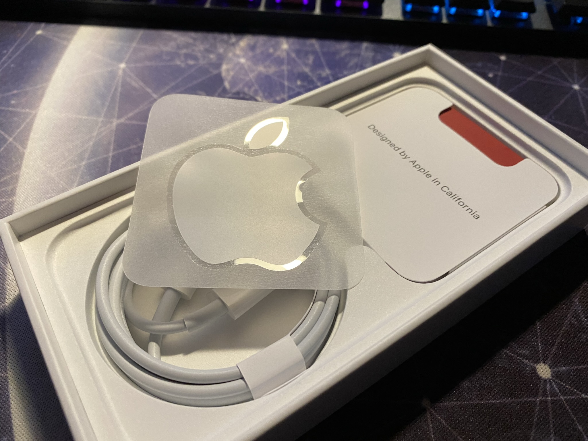
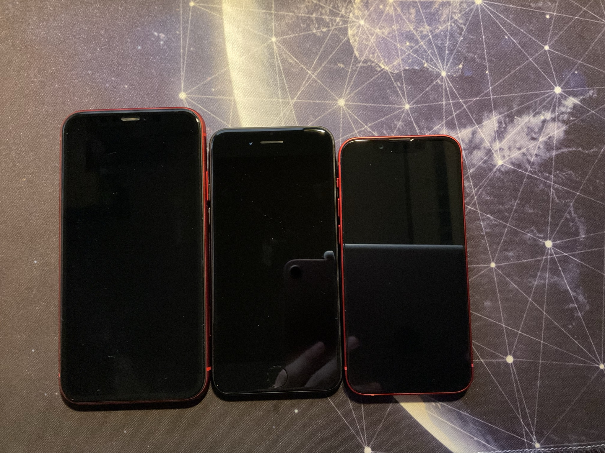
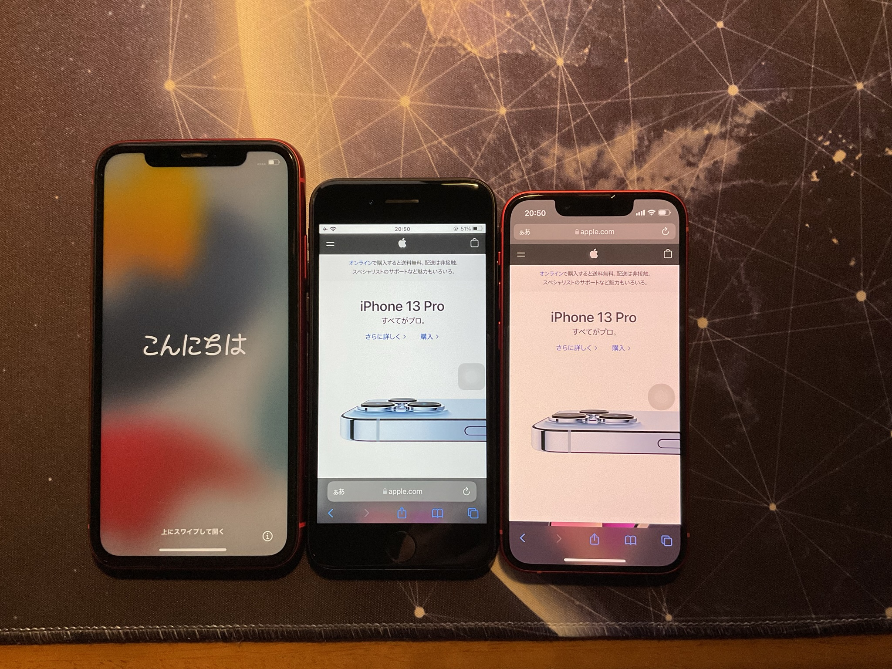

+++
author = "twoooooda"
title = "iPhone 13 mini買ったよー"
date = "2021-10-01"
description = "iPhone 13 min 128GB (product)RED買いました。"
tags = [
    "日記",
    "ガジェット",
    "散財"
]
categories = [
    "散財"
]

series = ["Themes Guide"]
aliases = ["migrate-from-jekyl"]
image = "IMG_3890.JPEG"
+++

私は今まで2019年モデルのiPhone11 64GBを使っていたのですが、購入当初からデカいし重いなぁと思い続けていました。そこで、先日のAppleの製品発表会で発表された**iPhone 13 mini**を買うことにしました。
 
 

## 13のminiにした理由
普段家にいるときは大抵の場合、デスクトップPCに向かって作業したり暇を潰しており、さらに巷を賑わしている流行り病のせいでその習慣には拍車がかかっていました。動画を見たりするのももちろんPCで見るので、**iPhone11**のような大きめのディスプレイを持つスマホは全く必要ありませんでした。しかも、昨年11月に発売された**iPad Air 4**も所持しているので、スマホの存在理由といったら移動時間などの空き時間にSNSを確認したり、mobile Suicaやpaypayでの支払いくらいなので、これを機に思い切ってスマホを小型化させることにした次第です。
 
 

## 本題
個人的にApple製品は配送よりも、Apple Storeに直接受け取りに行く方が体験として好きです。なので今回もApple Store心斎橋に受け取りに行きました。受け取りは9/30に行きました。

 

 
 

受け取りの手順としては、事前決済の時に発行される**注文番号**あるいは**専用QRコード**をスタッフに見せるだけで、製品を受け取れました。事前のAppleからのメールには「**公共機関が発行した写真付きの身分証明書**」が必要と書いてありましたが、特に提出は求められませんでした(学生証とか保険証とか住民票とか用意したのに～)。
 

### 受け取れた～

 

 
 
 

## ちっちゃ軽い、iPhone 13 mini
- 先代のiPhone11と比べると、ACアダプターが入ってない分箱がすっごい薄い。容量は128GBで、(product)REDの赤いモデルを買いました。
 
 

- 美しい～。箱を開けたときのこの感動はApple製品の醍醐味でもあります。
 
 

- 個人的な推しポイントが色み。iPhone11よりも深いレッドになってます。
 
 

- 箱の内容物はめちゃくちゃ簡素。意味のあるものといえば本体、ケーブル、SIMピンくらいしか入ってません。しかもLightning to USB type-Cという世界一使いにくいケーブルなのでこれすら意味があるのか疑わしい。
 
 

- 私が持っているiPhone7, 11, 13 miniの比較です(左から順に11, 7, 13 mini)。筐体サイズは13 miniが最小ですが、ホームボタンが無い分画面サイズは7よりも大きくなっています(画像2枚目のディスプレイの色調が違うのは、環境光によって色みを調節するTrue Toneという機能が13 miniでONになっているからだと思われる。11は写真撮る前にファクトリーリセットしちゃった)。 
  
 
 

## 丸1日くらい使ってみて
やはり軽くて小さいのは正義です。先代よりも驚くほど手にしっくりきます。よくあんな重いiPhone11なんか使ってたなと思うほどです。調べてみると11→13 miniでは**50gも軽く**なっているらしい。

もともとスマホでしていたことと言えばTwitterかYouTubeくらいなので、画面の小ささもそんなに不便を感じません。12 miniではかねてより言われていた**バッテリー問題**ですが、たしかに使っていると減っていっているという実感はあります。ですが今のところ極端にもたないという感じもないです。しかし、私はスマホで全くと言っていいほどゲームはやらないので、ゲームをある程度する人にとっては参考にならないかもしれません...
