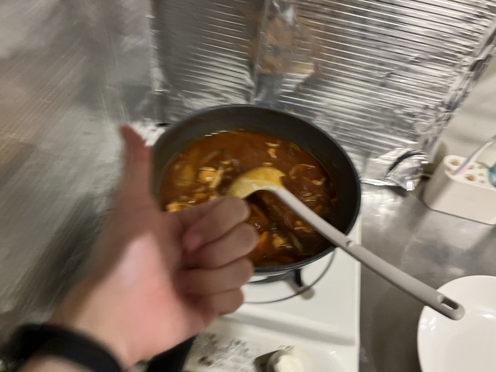

+++
author = "twoooooda"
title = "いっとりうむのハヤシライスレシピ"
date = "2024-12-1"
description = "美味しいですよ。"
tags = [
    "日記",
]
categories = [
    "diary"
]

series = ["Themes Guide"]
aliases = ["migrate-from-jekyl"]
image = "ReferenceImg/1137E795-BC69-48C6-8B63-842A42AF0F1A.jpeg"
slug="HowToMakeHayashiRice"
+++

## この記事は？
この記事は、[某企業アドベントカレンダー2024](https://adventar.org/calendars/10291)の1日目の記事です。
記事執筆ハードルを下げるための記事ですので、あえてTech系とは関係ない記事にしています。ご了承ください。
***
## ハヤシライスを、作ろ〜〜〜うよ‼️
この記事ではハヤシライスが大好きな私が作り続けた、いい感じのハヤシライスレシピをご紹介します。といっても、市販のルーと普通の食材を使った普通のレシピですので、普通のハヤシライスです。ですが、とっても美味しいです。お試しください。

## 材料（2食分）
- 完熟トマトのハヤシライスソース（おすすめ） 半箱
- 薄めの肉（牛肉だと美味しい、豚肉でも可）180g～250gくらい
- 玉ねぎ（デカければデカいほどよい）1個 サイズによっては2個
- ぶなしめじ 1株

## 作り方
### 材料を切る
1. まず玉ねぎを切ります。**薄切り**だと早く火が通りますし、ルーを楽しめます。しかし、煮込み時間によっては完全に溶けて消失してしまいます。**櫛切り**にすると食べ応えを増すことができます。煮込んでも溶けにくいですが、ハヤシライス感は若干薄まります。
2. 肉を切ります（切られていなければ）。でっけー肉を入れてやりましょう。
3. ぶなしめじの石づきを切ります。ただし、まだバラバラにしないでください。鍋に入れる直前に手で割いたほうが美味しい（らしい）です。ぶなしめじを一度凍らせて入れても美味しい（らしい）です。
