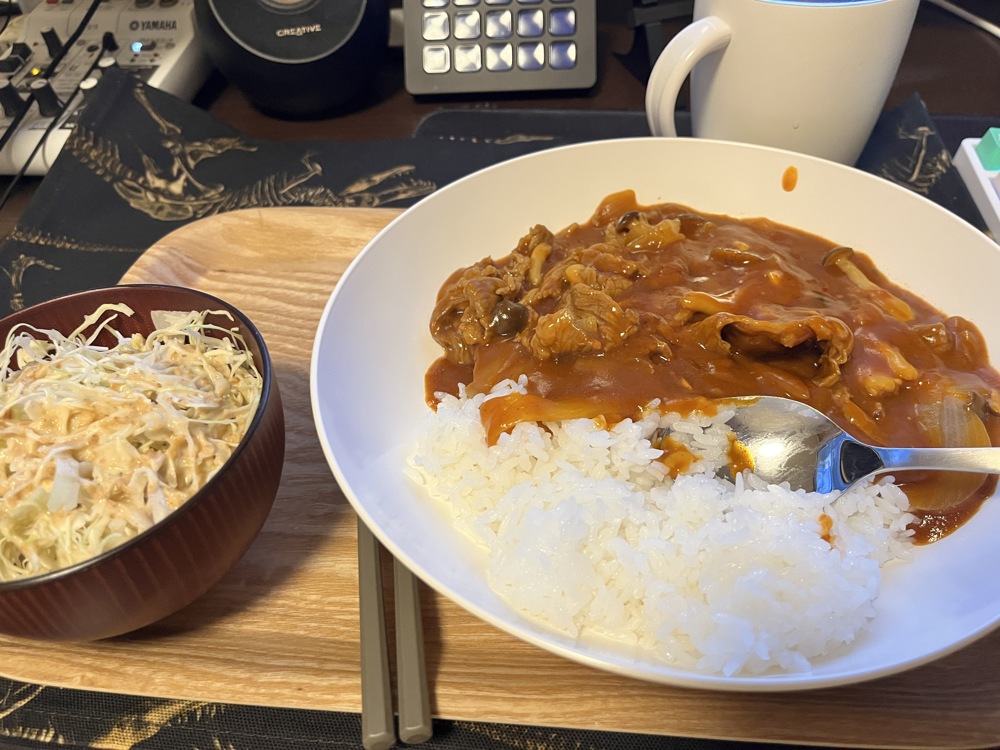

+++
author = "twoooooda"
title = "いっとりうむのハヤシライスレシピ"
date = "2024-11-30"
description = "美味しいですよ。"
tags = [
    "日記",
]
categories = [
    "diary"
]

series = ["Themes Guide"]
aliases = ["migrate-from-jekyl"]
image = "ReferenceImg/IMG_7520.JPG"
slug="HowToMakeHayashiRice"
+++

## この記事は？
　この記事は、[某企業アドベントカレンダー2024](https://adventar.org/calendars/10291)一日目の記事です。
記事執筆ハードルを下げるための記事ですので、あえてTech系とは関係ない記事にしています。ご了承ください。
***
## ハヤシライスを、作ろ〜〜〜うよ‼️
　この記事ではハヤシライスが大好きな私が作り続けた、いい感じのハヤシライスレシピをご紹介します。といっても、市販のルーと普通の食材を使った普通のレシピですし、箱の裏に書いてあるレシピほぼそのままの普通のハヤシライスです。ですが、とっても美味しいです。お試しください。

## 材料（2食分）
- 完熟トマトのハヤシライスソース（おすすめ） 半箱
- 薄めの肉（牛肉だと美味しい、豚肉でも可）180g～250gくらい
- 玉ねぎ（デカければデカいほどよい）1個 サイズによっては2個
- ぶなしめじ 1株
- 付け合わせの任意の草 適量

## 作り方
### 材料を切る
1. まず**玉ねぎ**を切ります。**薄切り**だと早く火が通りますし、ルーを楽しめます。しかし、煮込み時間によっては完全に溶けて消失してしまいます。**櫛切り**にすると食べ応えを増すことができます。煮込んでも溶けにくいですが、ハヤシライス感は若干薄まります。

2. 次に**肉**を切ります（切られていなければ）。でっけー肉を入れてやりましょう。
3. **ぶなしめじ**の石づきを切ります。ただし、ぶなしめじは一度凍らせて入れても美味しい（らしい）です。

### 材料を炒める
1. まず**玉ねぎ**を炒めます。炒めすぎると後の煮込みの行程で溶けてなくなるのでほどほどにするのがコツです。塩コショウをすると早く熱が通ります。

2. 玉ねぎに火が通ったら、**肉**を入れます。これも適当に塩コショウをするといいでしょう。いい感じにほぐしながら炒めていきます。

3. 肉にも火が通ったら、**ぶなしめじ**をほぐしながら入れます。これはサッと炒めるだけでおｋです。

### 煮込む
1. いい感じに火が通ったら、**水**を入れます。私は箱に書いてある分量よりちょっと多めに入れます。箱に書いてある時間だけ煮込みます。
2. いい感じに煮込めたら、一旦火を止めてルーを割り入れます。ルーをしっかり溶かせたら、また火をつけて箱に書いてある時間分だけ煮込みます。ときどきかき混ぜてください。

### 完成！
　いい感じに煮込めたら完成です。罪悪感消しの草と一緒に召し上がれ！

## 過去作

