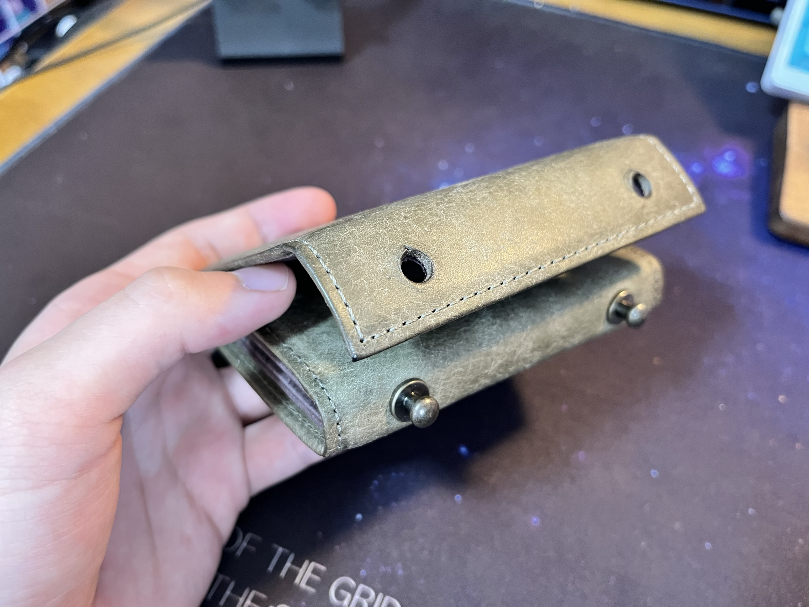
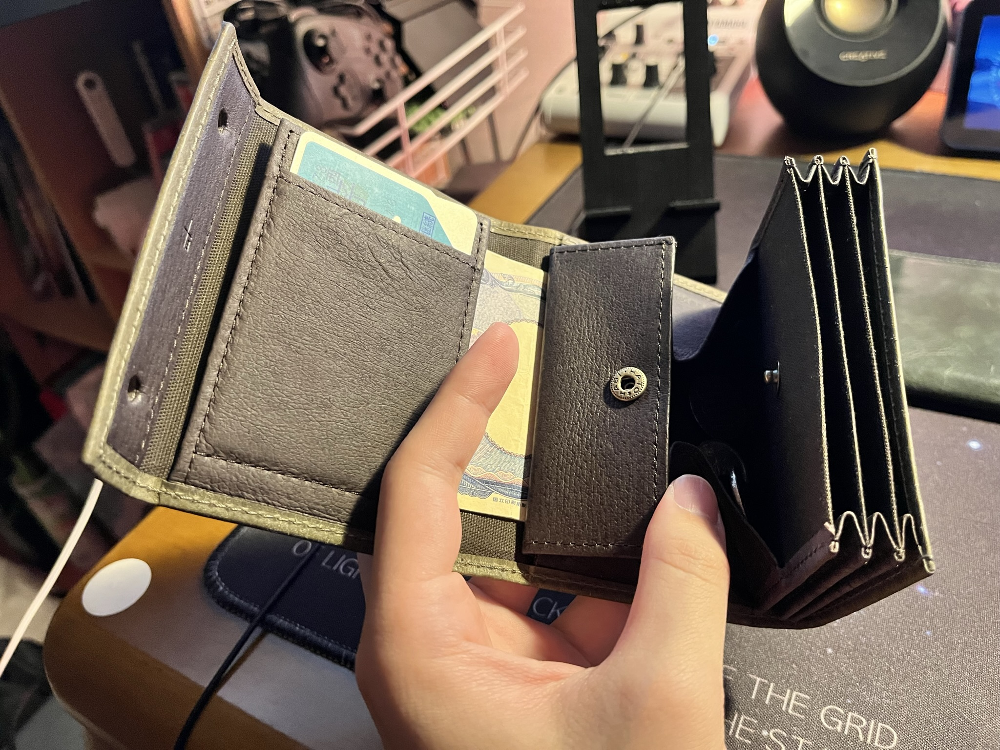
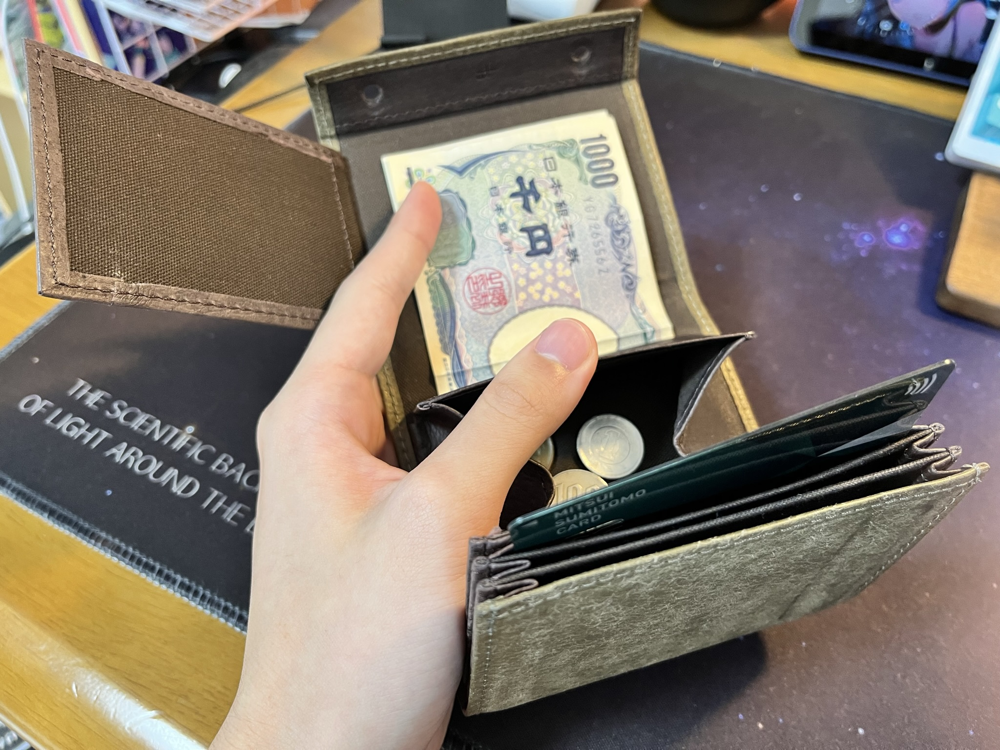
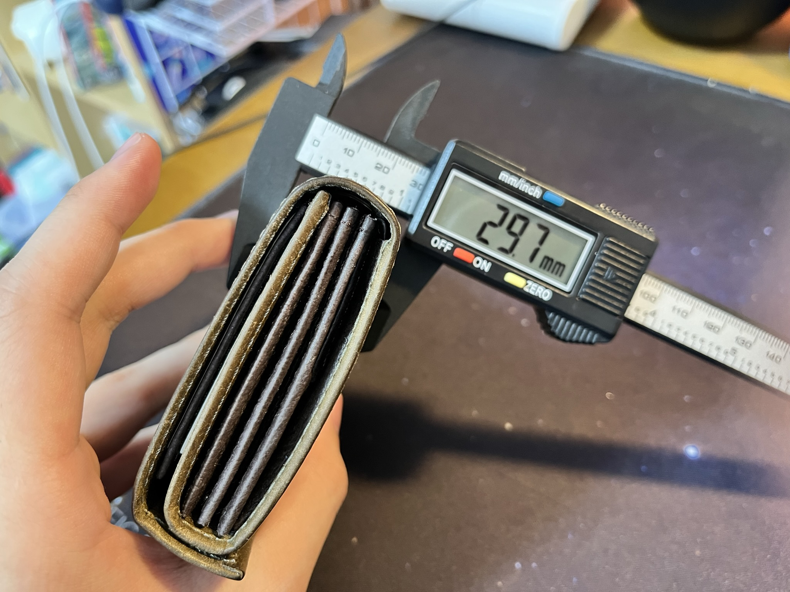
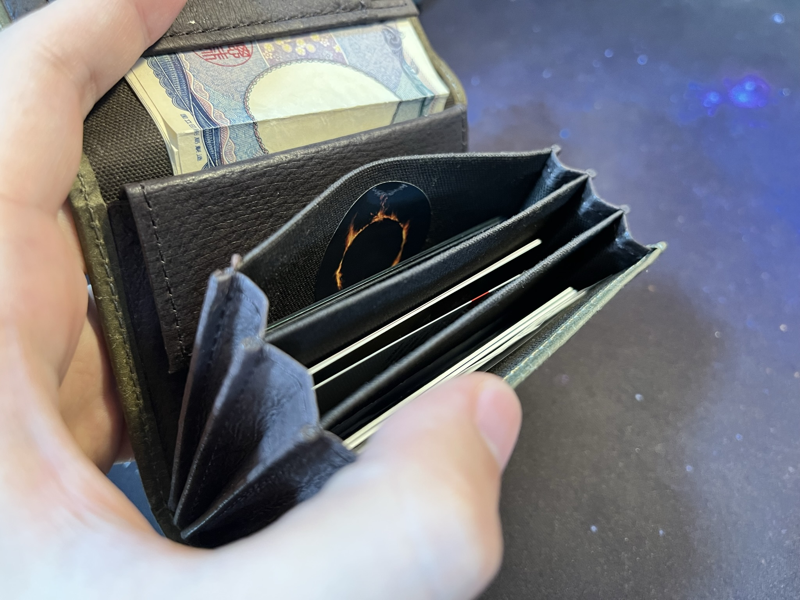

+++
author = "twoooooda"
title = "エムピウ ミッレフォッリエを買ったら良すぎた話"
date = "2023-05-22"
description = "数年ぶりに財布を新調したらおったまげた話です。"
tags = [
    "日記",
    "ガジェット",
    "日用品"
]
categories = [
    "diary"
]

series = ["Themes Guide"]
aliases = ["migrate-from-jekyl"]
image = "IMG_5159.jpeg"
slug="millefoglie-is-so-good"
+++

## 最近財布を新調しました

　今まではずっと長財布を使っていたのですが、昨今のキャッシュレスの波で現金を使わなくなり、だんだんと「なんでこんなデカい財布を持ち歩いてるんだ」と思うようになりました。
先代の財布を使い始めて既に4年くらい経過していたので、この機に小さい財布に変えようと思って探していると行きついたのが **m+（エムピウ）** というブランドの **millefoglie（ミッレフォッリエ）** という財布でした。 
[エムピウ公式サイト](https://m-piu.com/)

## エムピウ ミッレフォッリエとは

　ミッレフォッリエの「ミッレ」とは「千」、「フォリエ」とは「葉」を意味し、財布を横から見ると葉っぱが重なっているように見えることから名づけられたようです。
外側はぐるっと一枚の牛革で覆われており、ファスナーなどではなく二つの真鍮製のギボシでとめる形式です。
中身の構造はかなり独特で、カードポケットの下側にコインボックス、その下に札やレシートを挟みこんでカードフラップで抑えるような形です。

　コインボックスは大きく開き、小銭の確認がとてもしやすい構造です。カードポケットは三つあり、それぞれに5枚ずつ、合計15枚程度まで入るようです。カードフラップに交通系ICとかを入れるとそのままかざして改札を通れます。

## 買ったモデル

　私が買ったのは牛革の中でもプエブロレザーというレザーを使った **millefoglie P25 PU.grigio** です。
プエブロレザーとは牛革に敢えてやすりで傷をつける加工を施したレザーで、特に経年変化が早い上に変化の度合いが激しいことが特徴です。
[この動画](https://youtu.be/0zmorHUODE4)を見て頂くといかに変化が激しいかがわかると思います。

　なお、このミッレフォッリエは全国的に品薄で、新品はほとんど市場に出回っていないというお話でした（2023年5月現在）。私が買ったものは僅かな不良で新品として市場に出なかったアウトレット品らしく、その在庫があったのも幸運だったようです。ちなみにアウトレットになった理由は聞きそびれたので、どこが不良なのかは今でもわかっていません。
[販売サイト](https://www.free-spirits.co.jp/fs/mens/wallet00178)

## ミッレフォッリエの良いところ

　一番はやはり **コンパクトである** ということです。少し厚みはありますが、サイズ感はほとんどパスケースと大差なく、このサイズにかなりの量の現金とカード類を一緒に収納できる収納力も魅力です。

　あとは、何といっても **質感** ！！丁寧に鞣された牛革を撫でるだけでもテンションが上がります。また、革の経年変化も楽しみのうちです。使っていくうちに革に光沢と傷が入り色も深みを増し、自分だけの財布に育てていく感じが、私は大好きです。

## ミッレフォッリエのイマイチなところ

　コンパクト財布なので、外出先で不意に小銭が増えてしまうと、露骨に膨らんでしまうところは少し残念です。20枚以上とかになってしまうと閉まりきらないこともあるようです。また、一般的な長財布と違いカードポケットのカードを上から覗くことになるので、一覧性は落ちてしまいます。この点に関しては、三つのカードポケットに入れるカードを固定することで対応しています。

## まとめ ミッレフォッリエマジでいい

　いろいろ書いてきましたが、総合するとめちゃくちゃ良いです。質感が良いので特に意味もなく開けたり閉めたりしてしまうくらいです。財布として割と独特な見た目、形状をしているので、人とはちょっと変わった財布を持ちたい人、カードも現金も使う機会がある程度多い人などは特にオススメです。
