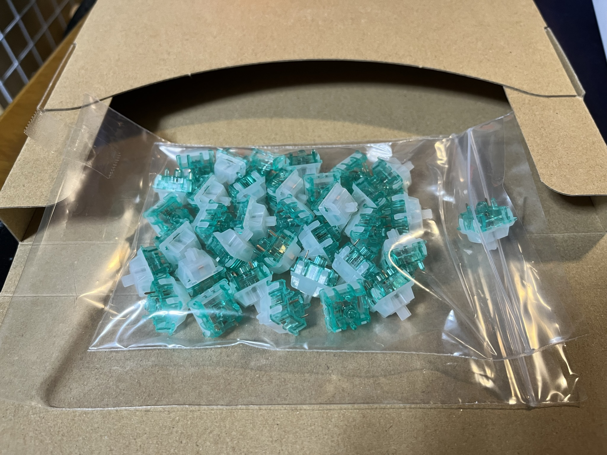

+++
author = "twoooooda"
title = "もらった左手デバイスのキースイッチを改造した話"
date = "2022-10-18"
description = "無料でもらったゲーム用の左手デバイスのキースイッチが気に入らなかったので改造しました。"
tags = [
    "日記",
    "ガジェット",
]
categories = [
    "ガジェット"
]

series = ["Themes Guide"]
aliases = ["migrate-from-jekyl"]
image = "IMG_4369.JPEG"
slug="remodeled left-hand device"
+++

　先日友人からAキーが利かなくなったゲーム用の左手デバイスをもらったので、修繕して使うつもりでしたが、ついでに改造することにしました（私の嫌いな青軸キースイッチだったので）。

## デバイスと初期状態
　もらった左手デバイスはアマゾンでよく見る[こういうやつ](https://amzn.asia/d/5EQnRBB)でした。いかにも中華製でしたが別段欠陥があるとかではなく、もらった時点でもAキーが利かない以外特に問題なく使えました。
    

## 分解
　分解も特に問題なくできました。ネジの形が特殊とか、引っかかってるツメが頑強だったとかもなく、一部のゴム足をはがすだけでネジも全て回せました。
 

## キースイッチ摘出
　中を開けてみると、案の定キースイッチは全てはんだ付けされていました。めんどくさいなー...と思いつつも、まさかホットスワップ式（はんだ付け無しでキースイッチを固定できる仕組み）であるとは微塵も思っていなかったので、大人しくはんだを吸い取りながら35個あったキースイッチを全て取り外しました。
    

## 新しいキースイッチ選定
　自分は普段[いつしかの記事](https://twoooooda.net/post/keybord-built-by-myself/)で作ったキーボードを使っていて、これには **FEKER like Holy Panda** というタクタイルのキースイッチを採用しています。タクタイルのキースイッチは文字を打つにはちょうどいいのですが、ゲームにはあまり向かないなぁと個人的に思っていたので（Holy Pandaの押下圧が気持ち重めだったのもある）、今回はゲーム用に使う予定だったのでリニアスイッチにすることにしました。
 

　最終的には **Tecsee Jaditeキースイッチ** というリニアキースイッチを採用しました。[TALP KEYBOARD](https://talpkeyboard.net/)さんという国内のサイトで買ったのですが、現在（2022年10月時点）は取り扱いが無いようです。
   

### ここで問題が
　届いたのでさぁ取り付けようと思ったのですが、なんとキースイッチが5ピンのタイプで、基板に刺さりませんでした...クッソめんどくさかったのですが、泣く泣く5ピンのうち2ピンをニッパーで切り取るということを全てのキースイッチにしました。
  
 

## せっかくなのでlubeも
　前回キーボード自作した時のグリスが残っていたので、せっかくなのでlubeもしておきました。今回はたったの35キーだったので、比較的楽でした（前回は98キー）。
 

## スイッチ取り付け
　もう後ははんだ付けするだけです。コツをつかめばスイッチの摘出も取り付けもすぐに終わりました。
 

## 完成
　組み立てて完成です。5ピンから3ピンに減らす過程でキースイッチを一個ダメにしてしまったので、Caps Lockキーだけ元の青軸スイッチのままになっています。
  
 

## 使用感
　やっぱりゲームにはリニア軸ですね（個人の意見）。lubeもしたので音も静かで良い感じです。ただ元が安価なデバイスなので、節々にチープな点が見えたり、軽いプラスチックの外装なので底打ちの音が微妙だったりしますが、総合的には改造してよかったなと思います。
 