+++
author = "twoooooda"
title = "私の自作キーボード奮闘記"
date = "2022-01-03"
description = "オタクもすなる自作キーボードといふものを、我もしてみむとてするなり。"
tags = [
    "日記",
    "ガジェット",
    "散財", 
    "MyNewGear"
]
categories = [
    "ガジェット"
]

series = ["Themes Guide"]
aliases = ["migrate-from-jekyl"]
image = "IMG_4085.JPEG"
slug="Keybord built by myself"
+++

しばらく前から**自作キーボード**の沼というものに興味があり、年が明けたら入るお年玉をアテに思い切って作ってみることにしました。

## 用いたパーツ
### PCB、ケース
　ケース、基板、プレート等がセットになっている[Tom980](https://ja.aliexpress.com/item/1005002964011779.html?spm=a2g0o.9042311.0.0.56ca4c4dMvOJNG)というコンパクトなフルサイズキーボード自作キット(98キー)を買いました。フルカラーLEDつき、ホットスワップ方式ではんだ付けがいらないというのも高得点です。安価ながらなかなかいいキットだと思います。アリエクスプレスで買いました。  

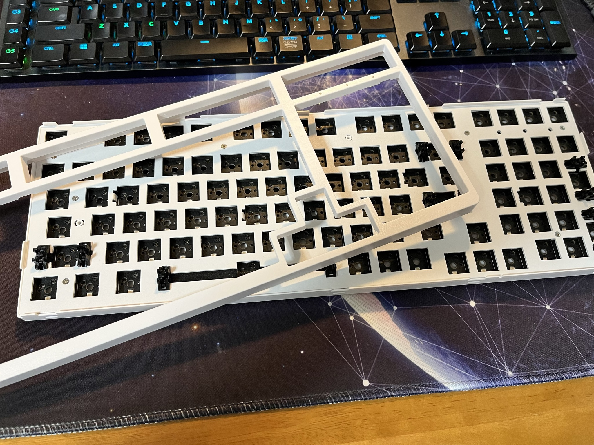 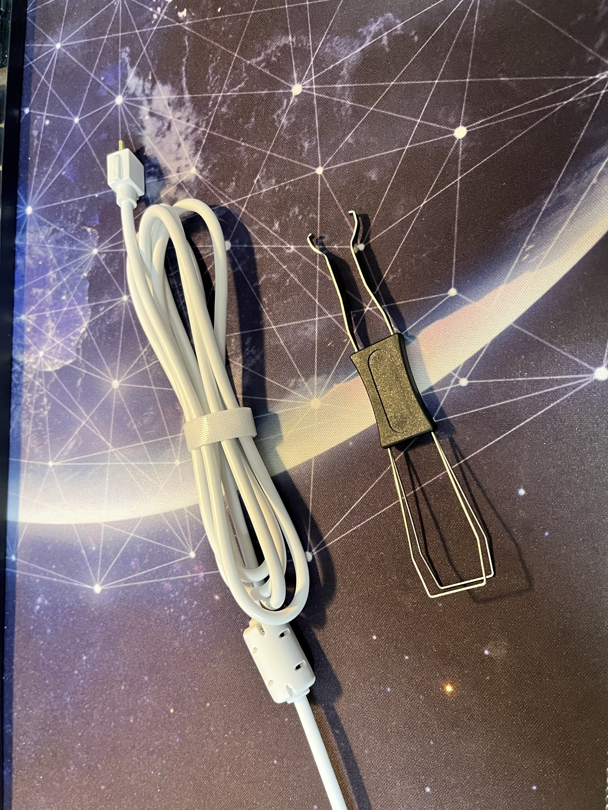

   

しかしこのキーボードキット、汎用のファームウェアであるQMKファームウェアに対応していない代わりに独自のファームウェアがあり、そちらにのみ対応しているようです。[redditのレビュー](https://www.reddit.com/r/MechanicalKeyboards/comments/ox075j/holy_tom980_wianxp_980_review/)に落ちていました。が、レビュー曰く、このファームウェアは "**almost complete garbage(ほぼ完全にゴミ)**" らしく、実際に使ってみても確かにゴミでした。具体的には、LEDの発光パターンや色は変えられるけど、特定のキーに別の役割を当てたり、マクロを割り当てたりなどがほぼ完全に機能していません。さらに(これは私だけの環境かもしれませんが)なぜか**ESCキーが右Winキーになって**しまっていたりでなかなかよくわからん挙動をしています(これはPC内の別のソフトウェアでなんとかした)。それ以外は概ね満足です。  
   

### キースイッチ
　キースイッチはいろいろ考えた結果、界隈では有名らしいHoly Pandaという高級タクタイルキースイッチの**廉価版**である[FEKER like Holy Panda](https://talpkeyboard.net/items/5fd61629b00aa37e7271319d)を採用しました。リンクから飛べるTALP KEYBORDという国内の自作キーボード専門店から購入しました。

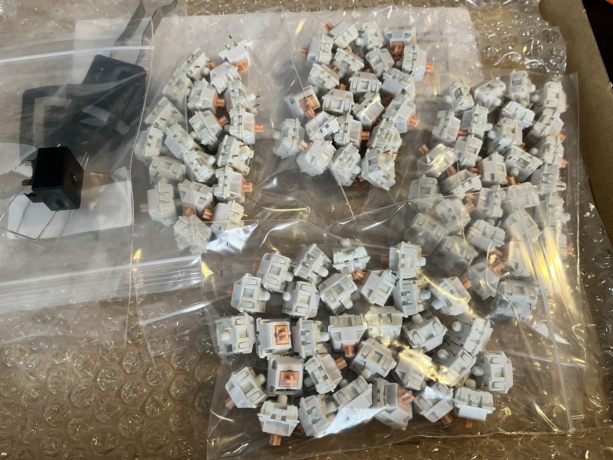 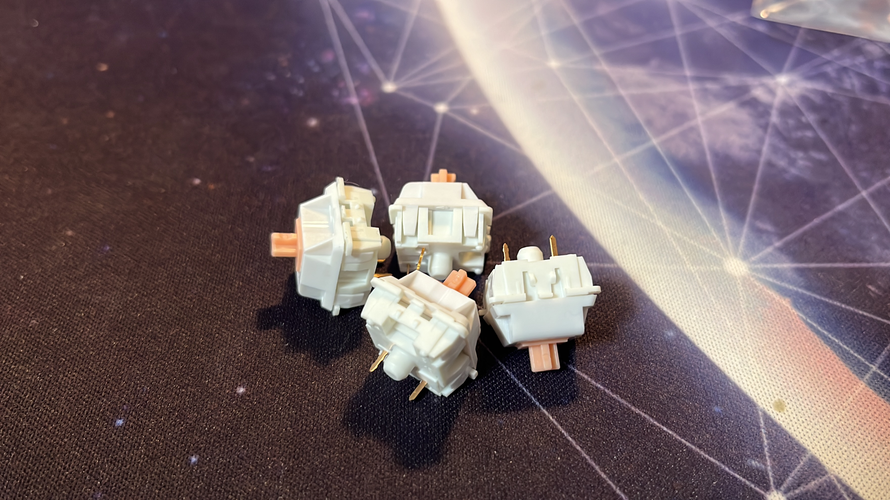

押下圧は公称で67gとなっており、少々重めです。分類はタクタイルとなっており、心地よいタイピング音とサクサク感のある押し心地でかなり好印象です。多少の個体差はあるものの買った100個すべてのスイッチがきちんと動作しており、品質も問題なしでした。TALP KEYBORDさんありがとうございました。  

### キーキャップ
　キーキャップは、アリエクスプレスで見つけたこの[可愛いキーキャップ](https://ja.aliexpress.com/item/1005001622318975.html?spm=a2g0o.9042311.0.0.56ca4c4dMvOJNG)をほぼ即決で採用しました。全体的にデザインがめちゃくちゃ好みで、キャップの種類も豊富で実物のクオリティもそれなりに高く満足しているのですが、届いたパッケージにはラベルも何もなく、ストアページも何か後ろめたいことがありそうな感じなので、まぁおそらく正規品ではないのでしょう。クリプトンフューチャーメディア等の初音ミク公式から発売されたらそちらに買い換えようと思います。
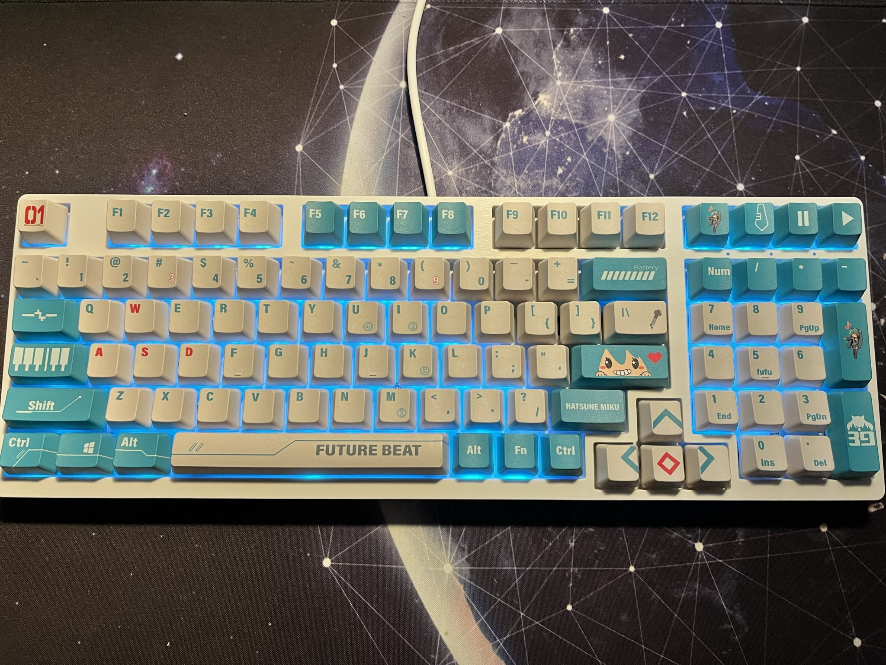 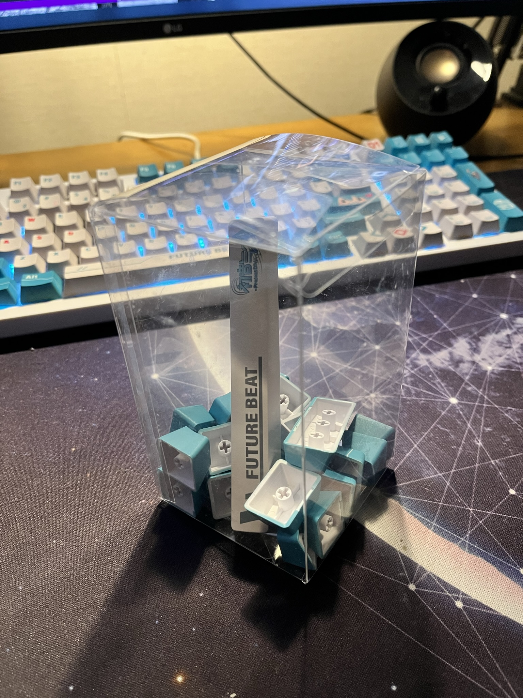

### その他に揃えたもの
　今回はlubeという、キースイッチの内部の擦れる部分にグリスを塗って音や打ち心地を改善する作業にも挑戦したかったので、それ用のツールもいくつか揃えました。
- スイッチを分解するための**キースイッチオープナー**([TALP KEYBORD](https://talpkeyboard.net/items/5ffc48fd8a45725bc56a391a)さんでスイッチと一緒に買った)
- キースイッチ内部に塗るグリス "**Tribosys 3203**" ([詳しく](https://shop.yushakobo.jp/collections/accessory/products/lubricants))
- lubeするパーツを置いておける**lubeステーション**(3Dプリンターで出力した。[使ったモデル](https://www.thingiverse.com/thing:4920600))
- 100均で買った細い筆

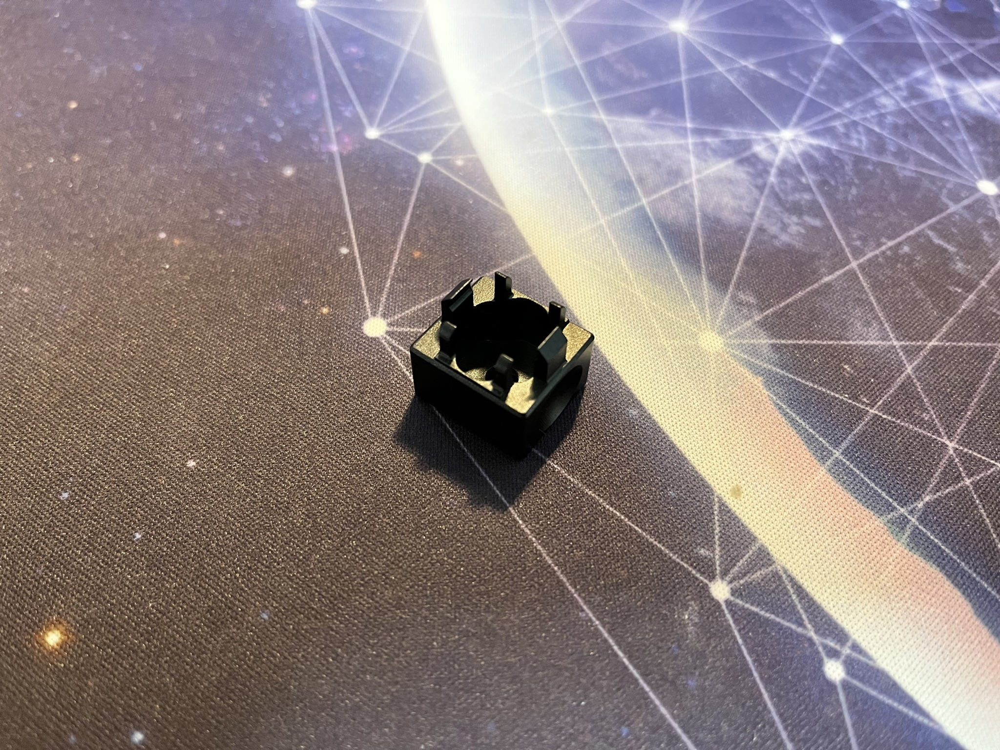 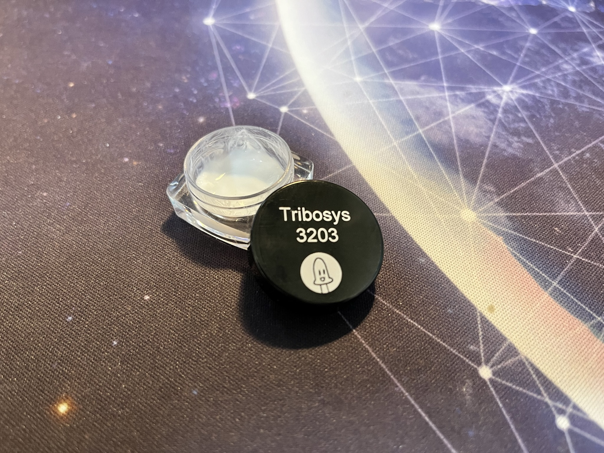
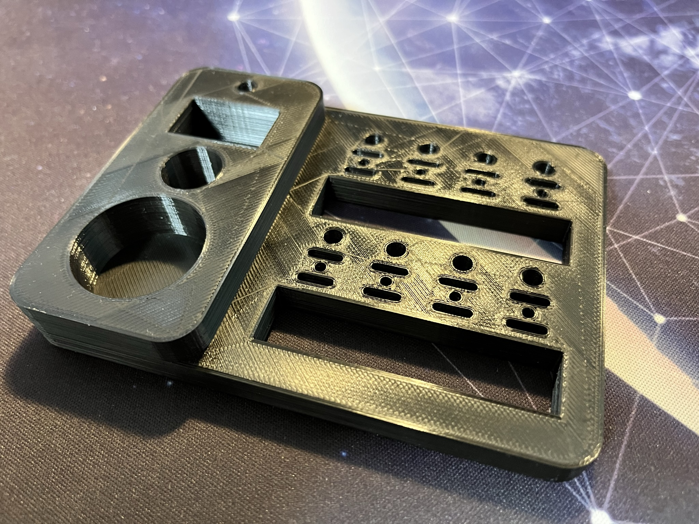 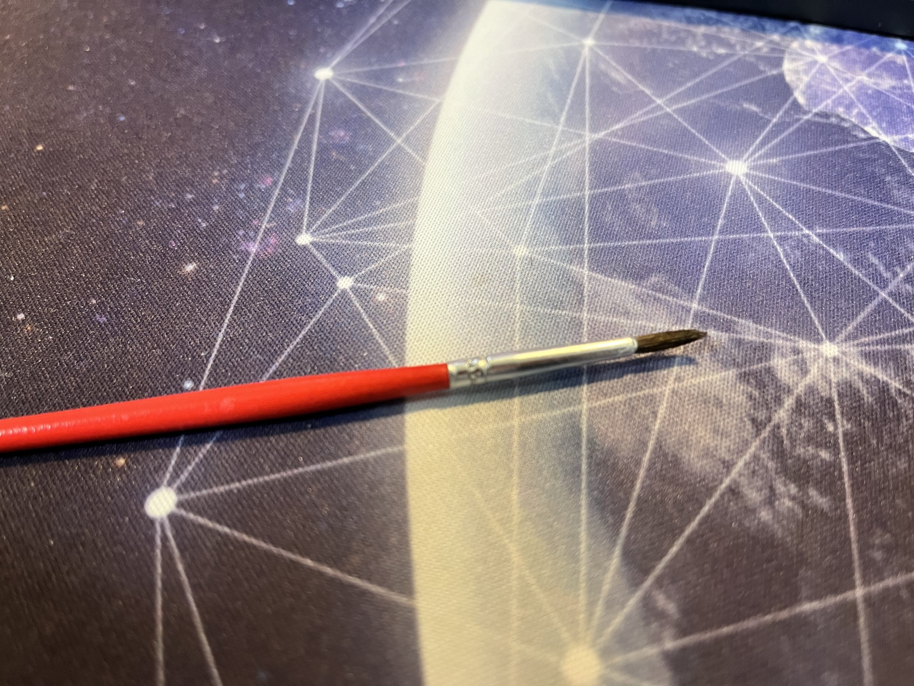  

## lubeが大変だった
　**大変でした...** 自作キーボードと言えば、Happy Hacking Keybordに代表される60%キーボードのような配列が一般的だと思いますが、今回作ったのはコンパクトながらフルサイズキーボードなので、98キーあります(ちなみに英字配列フルサイズキーボードは全部で102キー)。当然すべてのスイッチについてlubeしました。慣れるとスイッチ一つあたり5分くらいで済ませられるようになりましたが、かなり細かい作業なので一日にできる個数は限られており結局終わるまで数日かかりました(lubeしながら年越した)。  

グリスの選択や、塗る場所は[このサイト](https://keys.recompile.net/docs/keyswitch-best-practice/)を参考にしました。
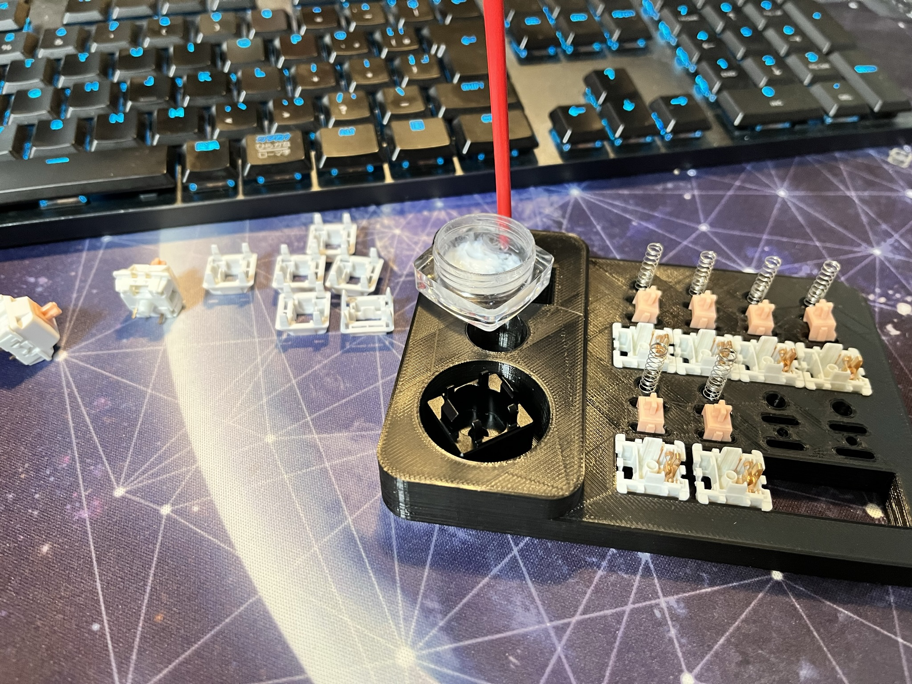  

　lubeの効果ですが、たしかにあるように**感じます**。lubeする前と後とでタイピングの比較はしてないので何とも言えないですが、カチャカチャというプラスチックが擦れるような音が軽減されたり、打ち心地がサクサクとした感触になったりで効果はあると思います。たぶん。ただ、60%キーボードならいざ知らず今回は98キーあるので、それら全てにlubeする労力と効果が見合うかは微妙です。私は普段からキーボードにかなり触るのでやってよかったと感じますが、とりあえず自作キーボードをやってみたいという方には障壁になるかもしれません。

## 総額でいくらくらい？
　詳細な値段はそれぞれのリンクから飛んでもらえれば値段はわかると思います。自作キットやキーキャップはアリエクスプレスで買ったので比較的安く抑えることができました。キースイッチやグリスはそれぞれ国内販売店である[TALP KEYBORD](https://talpkeyboard.net/)や[遊舎工房](https://shop.yushakobo.jp/)で購入したので、送料もかかり少し高くついてしまいました。  

筆やその他100均で買ったツール、lubeステーションの印刷代を除き、グリス代や送料を含めた総額は、**¥21,136**となりました。これを安いと見るか高いと見るかはあなた次第です...

## 総評
これまでつらつら書いてきましたが、金と時間をかけながらも**自分でキーボードを作って良かった**と思っています。キースイッチやグリスの選択、塗り方で押し心地や音を、外装やキーキャップの選択によってデザインを、ケースや基板によってキーボードの配列や機能を完全にカスタイマイズできるところが自作キーボードのいいところだと今回の挑戦でわかりました。少しでも気なった方は是非この沼に飛び込んでみては。
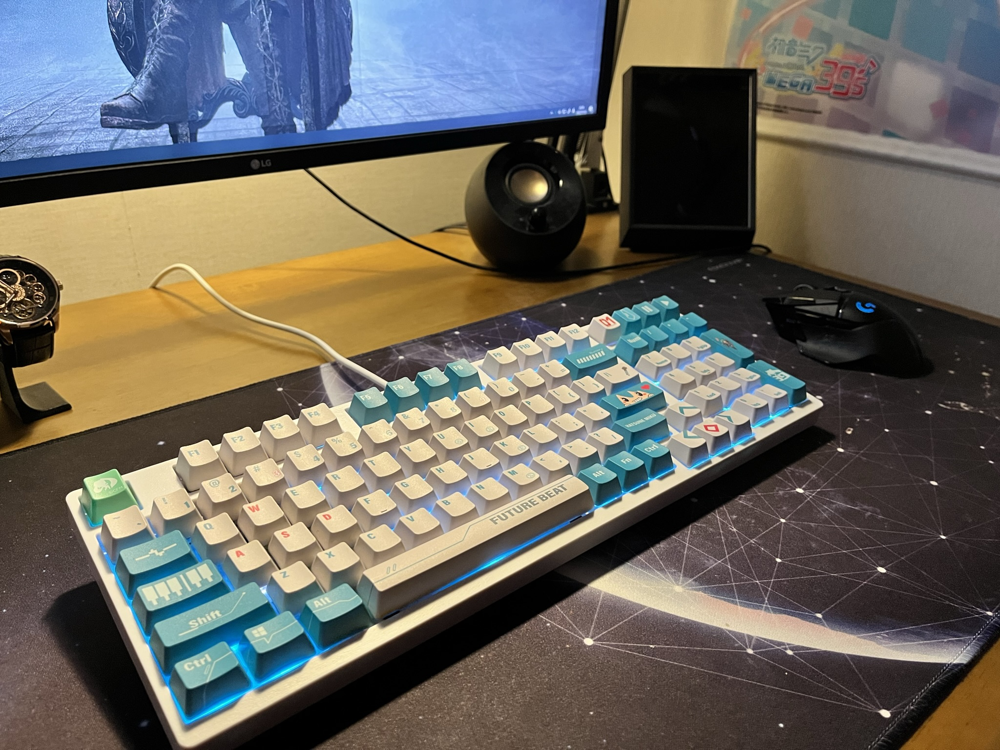 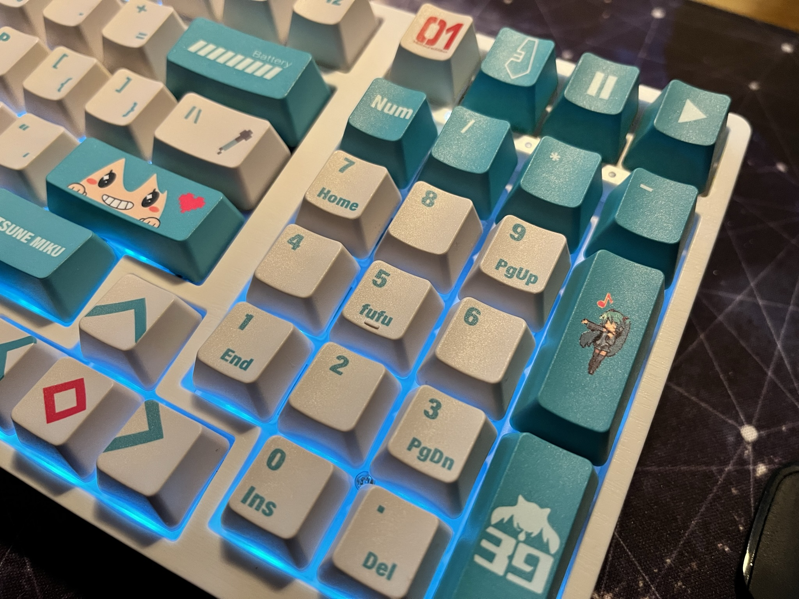

## 1/7追記
YouTubeにタイピング音の軽いデモを投稿しました。サウンドデモの動画なのにノイズがあったりで音周りが拙いですが、多少の参考になれば幸いです

 