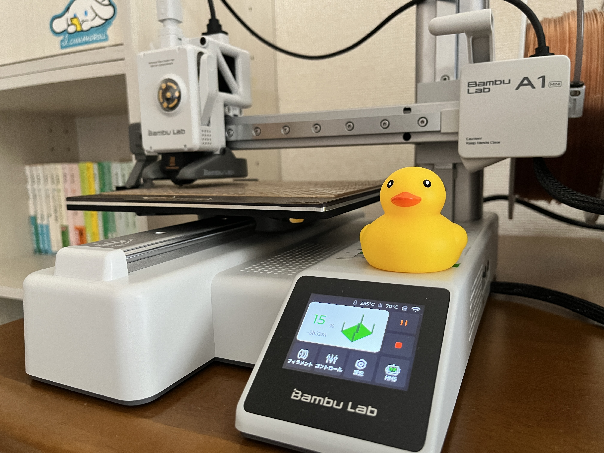
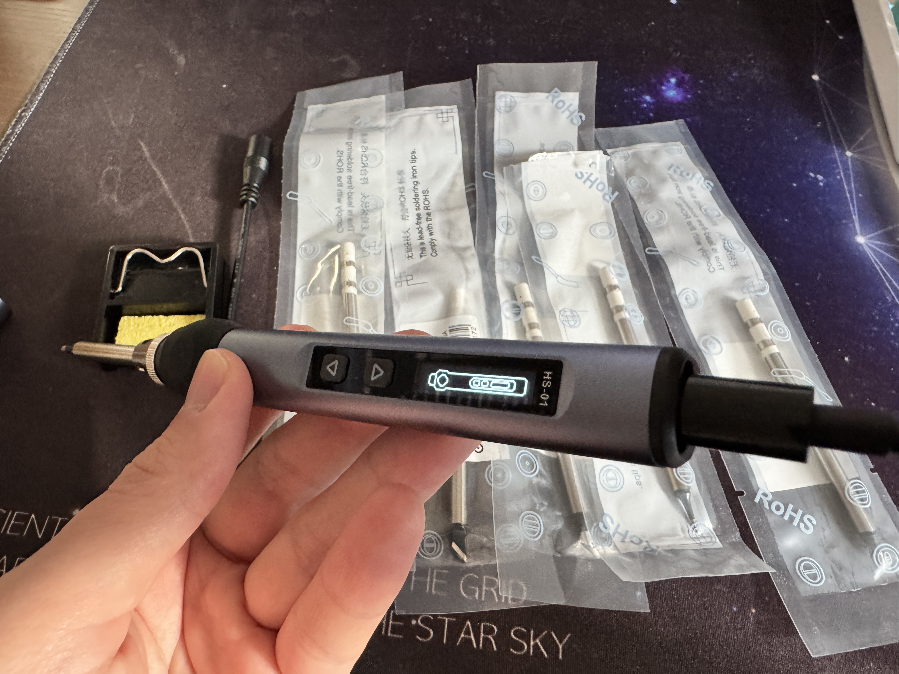
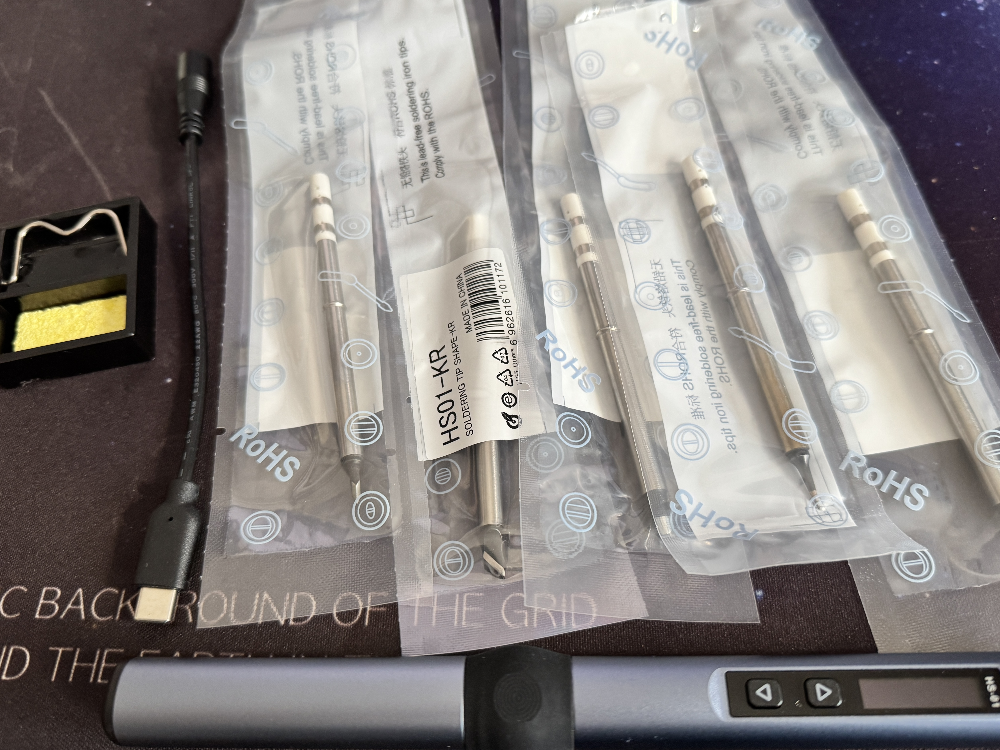
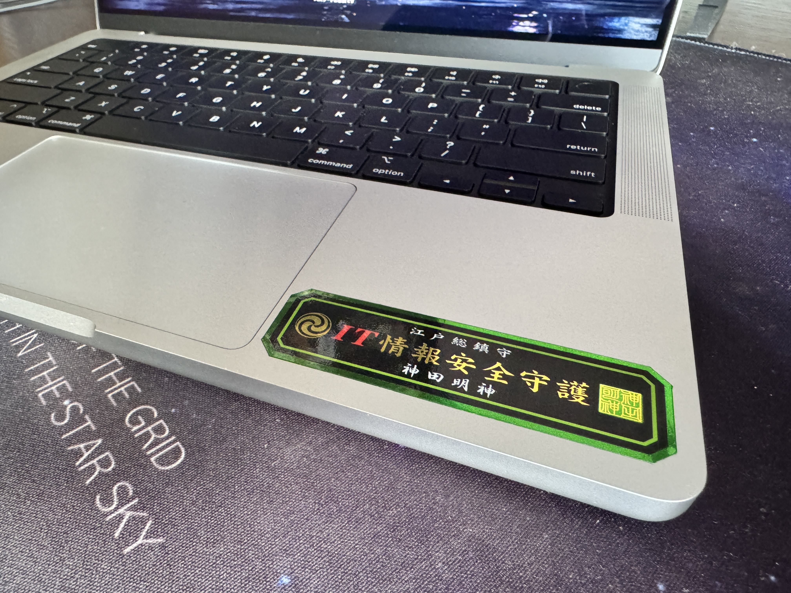
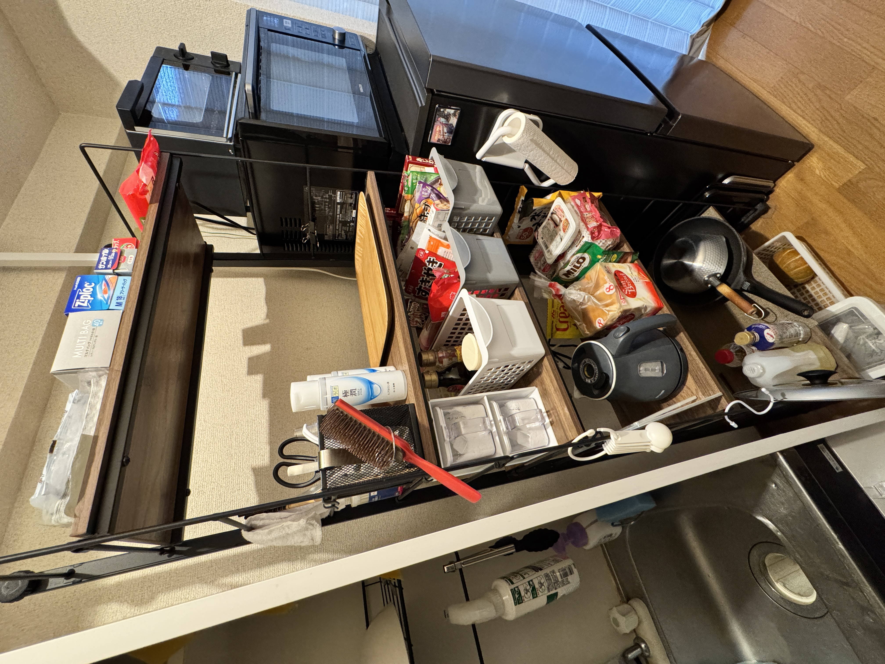

+++
author = "twoooooda"
title = "いっとりうむの買ってよかったもの2024"
date = "2024-12-08"
description = "今年も散財しました。"
tags = [
    "日記",
]
categories = [
    "diary"
]

series = ["Themes Guide"]
aliases = ["migrate-from-jekyl"]
image = "IMG_7538.JPG"
slug="katteyokatta"
+++

## この記事は？
　この記事は、[某企業アドベントカレンダー2024](https://adventar.org/calendars/10291) 八日目の記事です。
***

## 買ってよかったもの
　今年は就職で関西から関東に引っ越したのもあって、いろいろなものを買いました。中でも特に買ってよかったものを紹介します。順不同です。

### 3Dプリンタ A1 mini（Bambu Lab）
　2024年買ってよかったものを語るうえで避けられないのはやっぱりこの3Dプリンタです。印刷の精度もさることながら、セールで3万円くらいで買えるとは思えないプロダクトクオリティ、よく考えられたスマホ連携、印刷速度など、買ってよかった点を挙げればキリがないほど気に入っています。見た目もスタイリッシュでいい感じなので本気で一家に一台おススメできます。開封の様子などは[別の記事](https://twoooooda.net/post/3dprinter-kattemita/)でまとめているのでそちらもご覧ください。

### USBはんだごて HS-01（FNIRSI）
　今まで使っていた中華の激安はんだごてからそろそろ乗り換えたいなと思っていたところ、電気系のYouTuberであるイチケンさんが[とある記事](https://ichiken-engineering.com/usb_soldering_iron1/)でUSBはんだごてを紹介していたので買ってみました。

　今までのはんだごてはコンセントにつなぐ必要があったのですが、これはUSB TypeCで使えるので、机の脇から生えているType-Cケーブルを挿すだけで使えるのが一番便利なポイントです。数十秒～2分もあれば使える温度になりますし、軽量で取り回しもいいので重宝しています。私はAliExpressで[追加のこて先がついたセット](https://ja.aliexpress.com/item/1005005115153707.html?spm=a2g0o.order_list.order_list_main.10.2e64585aUM3APJ&gatewayAdapt=glo2jpn)を買いました。

### Macbook Pro （M4 Pro・Apple）
　正確には会社のお金で買ったものなのですが、この度Macbookデビューしました。PCを触り始めてからずっとWindows民がMacbookを触ると、まずTouch Padをはじめとしたハードウェア、ソフトウェアのUXが本当によくできているなと思いました。まだ完全に慣れたわけではないのでショートカットとか逆張り仕様につまずくことも多いですが、総合的にかなり触り心地がいいPCです。所有欲もみたされます（会社の固定資産ですが...）。

### MX Keys Mini（Logicool）
　これは今年買ったものではないですし、研究室から拝借しているものですが、今年から本格稼働を始めたのでノミネートです。私は基本的に仕事中はBacbookをクラムシェルモードで運用しているのでこういったBluetoothキーボードを重宝しています。このキーボードはテンキーレスでコンパクト、薄さと打鍵感をある程度両立しているバランスのいいワイヤオスキーボードです。登録先を3台まで保存でき、Fn + F1, F2, F3で瞬時に登録先を切り替えられるのもグッドです。

### サメ型ボディバッグ
　大阪梅田のルクアで偶然出会って、一目ぼれして入手しました。こういう何かをモチーフにしたアイテムが大好きなので、大変満足しています。誰に見せてもウケるので嬉しいです。

### バックパック Black Hole Mini MLC 30L（patagonia）
　先代のバックパックが6年くらい使ってボロボロだったので、ちょっといいやつをと思って新調しました。これのすごいところは、腰を固定するバンドをとりはずして肩掛けにできたり、肩ひもを収納してスーツケースに固定できたりと自由度が高い点です。蓋もバックリ開いてめちゃ便利です。

### Nポルダ（ニトリ）
　本棚の一つも実家から持ってこなかったので買いました。壁際に手軽に棚を追加でき、側面の骨にS字フックでいろいろ掛けられるのでかなり便利です。ただ、組み立てと設置が若干大変でした。

### Nボックス（ニトリ）
　同じく引っ越しのタイミングで買いました。同じシリーズなら縦横にドッキングしてカスタマイズできるのがめちゃくちゃ便利です。家では通常のカラーボックスに加えて、扉付き、段が一つ少ないものを買い足して小物の置き場所を増やしています。

### 伸縮カーペットクリーナー（ニトリ）
　ニトリで見かけて買いました。賃貸だと思った時間に掃除機をかけられないことがありますし、ちょっとしたゴミとか髪の毛を掃除したいときに重宝しています。持ち手が伸びるので腰へのダメージも低いです。

### 生徒会にも穴はある！（講談社・Kindle）
　ずっと前から追っていて、最近Kindleで全巻買いました。私はこういうギャグ味が強いラブコメが大好きでよく読むのですが、この漫画は最近読んだ中では一番刺さった漫画です。買え。読め。

[Kindleリンク](https://amzn.asia/d/aGlyHzH)

[連載リンク](https://pocket.shonenmagazine.com/episode/3269754496893564293)

